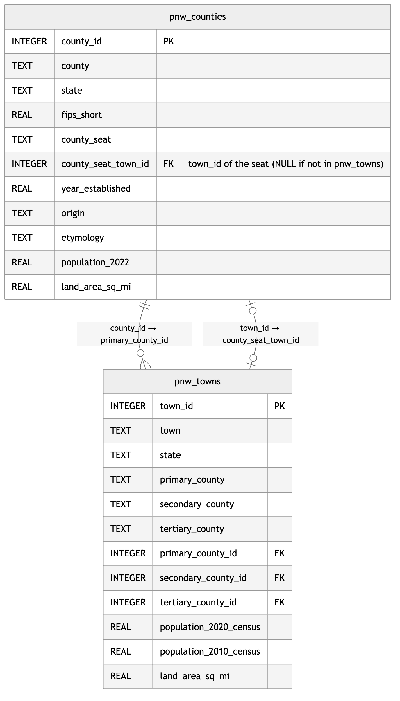
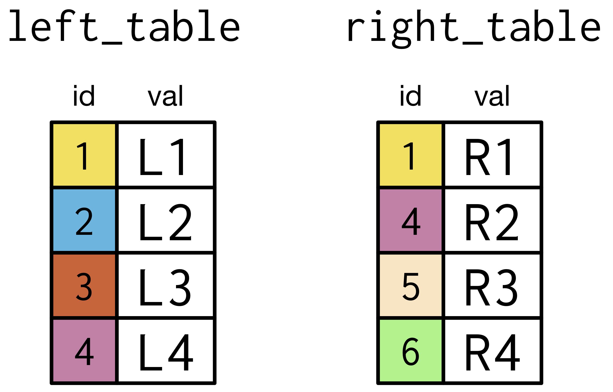
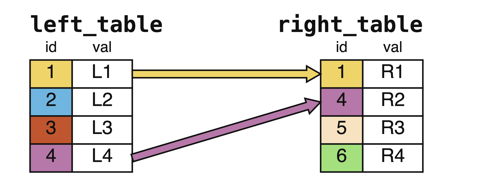
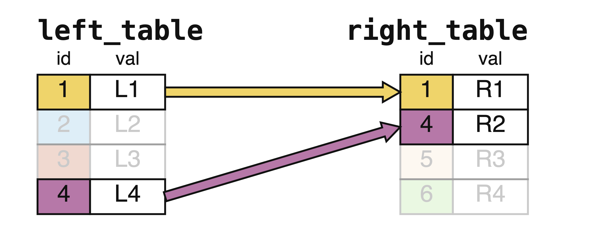
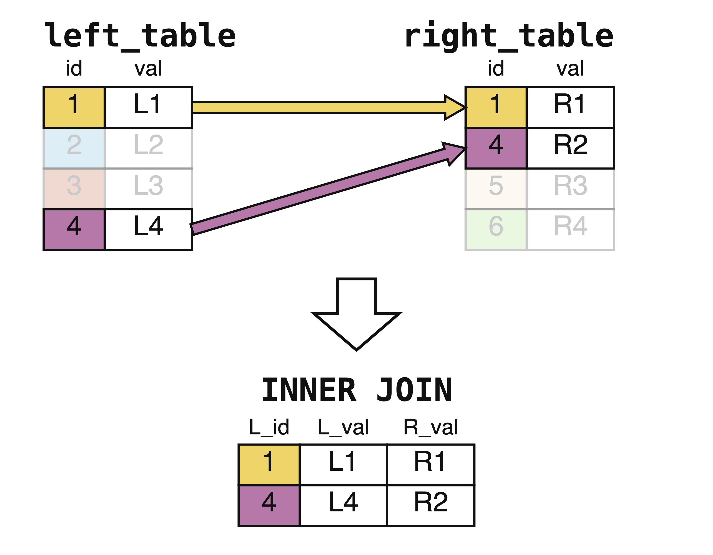
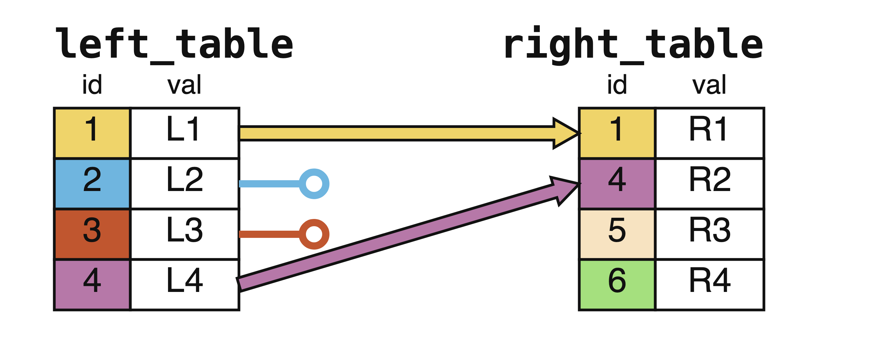
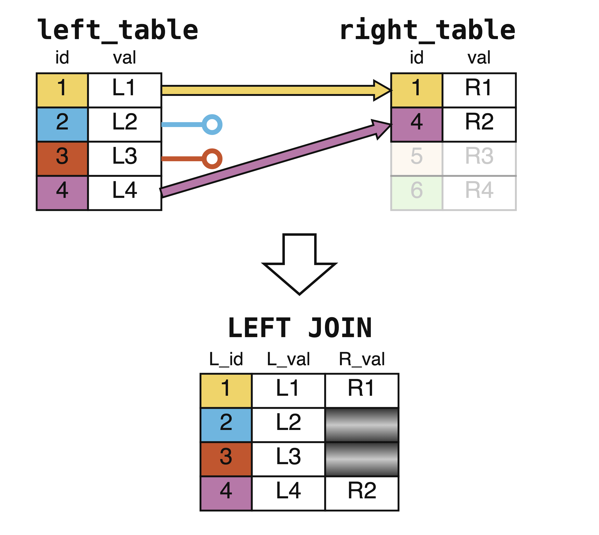
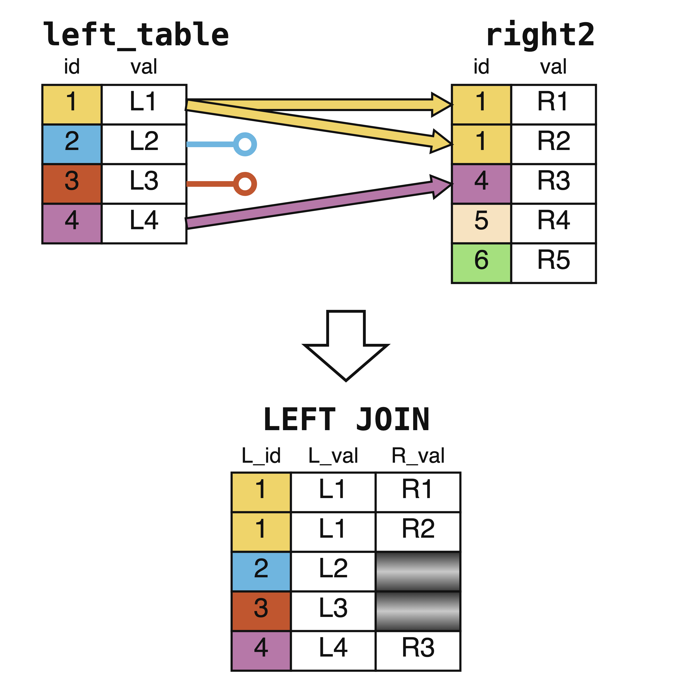
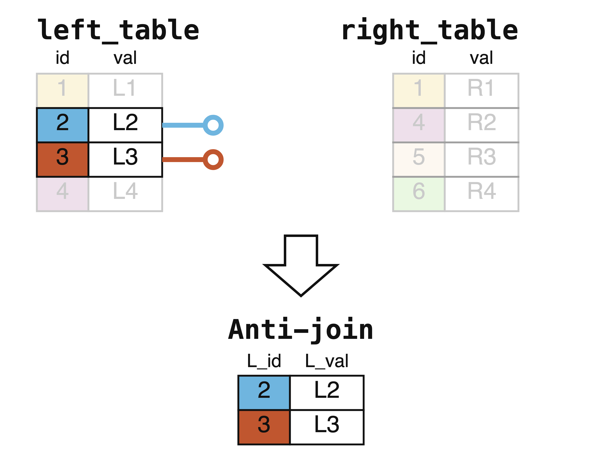

<style>
.title {
  margin-bottom: 0; /* Reduces space below the title */
}
.author {
  margin-top: 0; /* Reduces space above the author */
}
</style>

<div class="title">
  <h1>SQL Examples on Pacific Northwest Towns and Counties data</h1>
</div>
<div class="author">
  <h3>Author: Dr. Chester Ismay</h3>
</div>

<!--
Note that query results are capped at 20 records maximum to avoid the page being unable to load.
-->

```{r setup, include=FALSE}
library(learnr)
suppressPackageStartupMessages(library(gradethis))
library(DBI)
library(RSQLite)
suppressPackageStartupMessages(library(tidyverse))

# Copy data over into this folder
# file.copy(from = "../flights2023/pnwflights23/data/airlines.rda", 
#           to = "data/airlines.rda")
# file.copy(from = "../flights2023/pnwflights23/data/airports.rda",
#           to = "data/airports.rda")
# file.copy(from = "../flights2023/pnwflights23/data/flights.rda",
#           to = "data/flights.rda")
# file.copy(from = "../flights2023/pnwflights23/data/planes.rda",
#           to = "data/planes.rda")
# file.copy(from = "../flights2023/pnwflights23/data/weather.rda",
#           to = "data/weather.rda")

# Read data in from RDS files
# source("02-sql_tables_tutorial.R")
library(DBI)
library(RSQLite)
library(tidyverse)

# Read data from RDS files
pnw_counties_df <- as.data.frame(read_rds("exercises/data/pnw_counties.rds"))
pnw_towns_df <- as.data.frame(read_rds("exercises/data/pnw_towns.rds"))
fips <- as.data.frame(read_rds("exercises/data/fips.rds"))

# Connect to the SQLite database
con <- dbConnect(SQLite(), ":memory:")

# Write the new data to the database
dbWriteTable(con, "pnw_counties", pnw_counties_df, overwrite = TRUE)
dbWriteTable(con, "pnw_towns", pnw_towns_df, overwrite = TRUE)
dbWriteTable(con, "fips", fips, overwrite = TRUE)

knitr::opts_chunk$set(connection = "con")# , 
#                      max.print = 20)
```

```{r setup2, echo=FALSE, out.width='100%', fig.align='center'}
tutorial_options(exercise.cap = "Query", 
                 exercise.eval = FALSE,
                 exercise.reveal_solution = TRUE)
```

```{r eval=FALSE, echo=FALSE}
library(DiagrammeR)
# https://github.com/bergant/datamodelr
library(datamodelr)

pnw_counties <- pnw_counties_df
pnw_towns <- pnw_towns_df

dm_f <- dm_from_data_frames(pnw_counties, pnw_towns)

dm_f <- dm_add_references(
  dm_f,
  
  pnw_counties$county == pnw_towns$primary_county,
  pnw_counties$state == pnw_towns$state
)

graph <- dm_create_graph(dm_f, rankdir = "BT", col_attr = c("column", "type"))

dm_render_graph(graph)
```

```{r eval=FALSE, echo=FALSE}
build_mermaid_er <- function(df_list, pk_cols, fk_cols) {
  # df_list: named list of data frames
  # pk_cols: named list like list(table_name = c("col1", "col2"))
  # fk_cols: named list like list(table_name = c("col1", "col2"))
  
  lines <- "erDiagram"
  
  for (tbl_name in names(df_list)) {
    df <- df_list[[tbl_name]]
    lines <- c(lines, paste0("    ", tbl_name, " {"))
    
    for (col in names(df)) {
      col_type <- class(df[[col]])[1]
      
      # Determine key status
      key_marker <- ""
      if (col %in% pk_cols[[tbl_name]]) {
        key_marker <- " PK"
      } else if (col %in% fk_cols[[tbl_name]]) {
        key_marker <- " FK"
      }
      
      lines <- c(lines, paste0("        ", col_type, " ", col, key_marker))
    }
    
    lines <- c(lines, "    }")
  }
  
  # Add relationship
  lines <- c(lines, '    pnw_counties ||--o{ pnw_towns : "contains"')
  
  paste(lines, collapse = "\n")
}

# Usage
mermaid_code <- build_mermaid_er(
  df_list = list(pnw_counties = pnw_counties, pnw_towns = pnw_towns),
  pk_cols = list(pnw_counties = c("county", "state"), pnw_towns = NULL),
  fk_cols = list(pnw_counties = NULL, pnw_towns = c("primary_county", "state"))
)

cat(mermaid_code)
# https://mermaid.ai/app/projects/b63a9376-3040-4666-a51d-2dafa52b02a7/diagrams/3ba33e9c-5d22-4bc8-97f5-8a7bed66825c/version/v0.1/edit
```


<details open>
<summary style="display: inline-block; padding: 8px 16px; background-color: #337ab7; color: white; border-radius: 4px; cursor: pointer; font-weight: bold;">Click to show/hide ER Diagram</summary>
<br><br>

</details>

<style>
.small-yellow-btn {
padding: 5px 10px; /* Adjust padding to reduce size */
font-size: 12px; /* Smaller font size */
border-radius: 5px; /* Adjust border radius for rounded corners */
background-color: yellow; /* Set background color to yellow */
color: black; /* Text color */
border: 1px solid darkgray; /* Optional: add border */
}
</style>

<style>
.hint-container {
margin-left: 40px; /* Adjust indentation as needed */
}
</style>

# Selection Techniques

## Selecting columns/fields

Imagine you work for a regional planning agency and need to pull specific information from your database. The SELECT statement lets you choose exactly which columns you need.

### Selection 1: Create a quick reference list of all town names

*Scenario: You need a simple list of town names for a mail merge or dropdown menu.*

```{sql example1, exercise=TRUE, exercise.eval=FALSE}
-- Write your SQL query here
```

```{sql example1-solution}
SELECT town
  FROM pnw_towns;
```

### Selection 2: List all counties in the Pacific Northwest

*Scenario: You're preparing a report header that needs to list every county in the region.*

```{sql example2, exercise=TRUE, exercise.eval=FALSE}
-- Write your SQL query here
```

```{sql example2-solution}
SELECT county
  FROM pnw_counties;
```


### Selection 3: Export all town data for a comprehensive audit

*Scenario: An auditor needs the complete towns dataset. Using `*` selects every column.*

```{sql example3, exercise=TRUE, exercise.eval=FALSE}
-- Write your SQL query here
```

```{sql example3-solution}
SELECT *
  FROM pnw_towns;
```

### Selection 4: Pull county names and populations for a funding report

*Scenario: Federal funding is allocated by population. You need county names paired with their 2022 population figures.*

```{sql example4, exercise=TRUE, exercise.eval=FALSE}
-- Write your SQL query here
```

```{sql example4-solution}
SELECT county, population_2022
  FROM pnw_counties;
```

## Aliasing

Aliases make your output more readable and your queries easier to write. They're especially useful when column names are long or when you're doing calculations.

### Aliasing 1: Create a clean report with user-friendly column headers

*Scenario: You're sharing data with non-technical stakeholders who won't understand `land_area_sq_mi`. Show each county's `county` as county_name, its `population_2022` as population, and its `land_area_sq_mi` as area_square_miles.*

```{sql example5, exercise=TRUE, exercise.eval=FALSE}
-- Write your SQL query here
```

```{sql example5-solution}
SELECT county AS county_name, 
       population_2022 AS population,
       land_area_sq_mi AS area_square_miles
  FROM pnw_counties;
```

### Aliasing 2: Use table aliases to simplify longer queries

*Scenario: When writing complex queries with multiple tables, short table aliases save typing and improve readability. Select the county, county_seat, and year_established columns from the counties table.*

```{sql example6, exercise=TRUE, exercise.eval=FALSE}
-- Write your SQL query here
```

```{sql example6-solution}
SELECT c.county,
       c.county_seat,
       c.year_established
  FROM pnw_counties AS c;
```

## Unique entries

DISTINCT removes duplicate values, helping you understand the unique categories in your data.

### Unique 1: What states are represented in our towns database?

*Scenario: Before running state-specific analyses, you need to know which states are in the dataset.*

```{sql example7, exercise=TRUE, exercise.eval=FALSE}
-- Write your SQL query here
```

```{sql example7-solution}
SELECT DISTINCT state
  FROM pnw_towns;
```

### Unique 2: Which counties appear as a secondary county for any town?

*Scenario: Some towns span county lines. List each distinct county that shows up in the secondary_county column.*

```{sql example8, exercise=TRUE, exercise.eval=FALSE}
-- Write your SQL query here
```

```{sql example8-solution}
SELECT DISTINCT secondary_county
  FROM pnw_towns
 WHERE secondary_county IS NOT NULL;
```

## Counting

COUNT helps you understand the size of your data and answer "how many" questions.

### Counting 1: How many towns are in our database?

*Scenario: A journalist asks how comprehensive your database is. You need a quick count, reported as total_towns.*

```{sql example10, exercise=TRUE, exercise.eval=FALSE}
-- Write your SQL query here
```

```{sql example10-solution}
SELECT COUNT(*) AS total_towns
  FROM pnw_towns;
```

### Counting 2: How many states does our county data cover?

*Scenario: You want to verify your data covers both Oregon and Washington (and only those states). Report the count of distinct states as number_of_states.*

```{sql example11, exercise=TRUE, exercise.eval=FALSE}
-- Write your SQL query here
```

```{sql example11-solution}
SELECT COUNT(DISTINCT state) AS number_of_states
  FROM pnw_counties;
```

### Counting 3: How many towns lie entirely within a single county?

*Scenario: Most towns never cross a county line. Count the towns with no secondary county, reported as towns_single_county.*

```{sql example11b, exercise=TRUE, exercise.eval=FALSE}
-- Write your SQL query here
```

```{sql example11b-solution}
SELECT COUNT(*) AS towns_single_county
  FROM pnw_towns
 WHERE secondary_county IS NULL;
```

# Filtering Techniques

## Filtering rows/records

The WHERE clause is your primary tool for finding specific records. Think of it as asking questions of your data.

### Filtering 1: Which towns qualify as "cities" (population over 50,000)?

*Scenario: You're researching urban development and need to identify the larger municipalities. Show each town with its state and population_2020_census, largest first.*

```{sql example12, exercise=TRUE, exercise.eval=FALSE}
-- Write your SQL query here
```

```{sql example12-solution}
SELECT town, state, population_2020_census 
  FROM pnw_towns 
 WHERE population_2020_census > 50000
 ORDER BY population_2020_census DESC;
```

### Filtering 2: Find large Oregon cities for a state-specific grant

*Scenario: An Oregon-only grant targets cities over 50,000 people. Who qualifies? Show each town and its population_2020_census, largest first — since every result is in Oregon, the state column is deliberately left out.*

```{sql example13, exercise=TRUE, exercise.eval=FALSE}
-- Write your SQL query here
```

```{sql example13-solution}
SELECT town, population_2020_census 
  FROM pnw_towns 
 WHERE population_2020_census > 50000
   AND state = 'Oregon'
 ORDER BY population_2020_census DESC;
```

### Filtering 3: Find either large cities OR any Oregon town

*Scenario: A regional initiative includes all Oregon towns plus major cities from Washington. The OR operator creates a union of conditions. Show town, state, and population_2020_census.*

```{sql example14, exercise=TRUE, exercise.eval=FALSE}
-- Write your SQL query here
```

```{sql example14-solution}
SELECT town, state, population_2020_census 
  FROM pnw_towns 
 WHERE population_2020_census > 100000
    OR state = 'Oregon'
 ORDER BY state, population_2020_census DESC;
```

### Filtering 4: Find historically significant, populous counties

*Scenario: A heritage tourism initiative targets counties established before 1860 that now have substantial populations (over 50,000). Show each county with its state, year_established, and population_2022.*

```{sql example15, exercise=TRUE, exercise.eval=FALSE}
-- Write your SQL query here
```

```{sql example15-solution}
SELECT county, state, year_established, population_2022
  FROM pnw_counties
 WHERE year_established < 1860
   AND population_2022 > 50000
 ORDER BY year_established;
```

### Filtering 5: Find mid-sized towns (population between 10,000 and 50,000)

*Scenario: A "Main Street" revitalization program targets mid-sized towns. BETWEEN provides a clean way to specify ranges. Show town, state, and population_2020_census.*

```{sql example16, exercise=TRUE, exercise.eval=FALSE}
-- Write your SQL query here
```

```{sql example16-solution}
SELECT town, state, population_2020_census
  FROM pnw_towns
 WHERE population_2020_census BETWEEN 10000 AND 50000
 ORDER BY population_2020_census DESC;
```

### Filtering 6: Find compact towns (small land area)

*Scenario: Urban planners studying density want towns under 2 square miles. Show each town with its state, land_area_sq_mi, and population_2020_census.*

```{sql example17, exercise=TRUE, exercise.eval=FALSE}
-- Write your SQL query here
```

```{sql example17-solution}
SELECT town, state, land_area_sq_mi, population_2020_census
  FROM pnw_towns
 WHERE land_area_sq_mi < 2
 ORDER BY land_area_sq_mi;
```

### Filtering 7: Complex criteria with parentheses

*Scenario: Find either (a) old Washington counties established before 1860, or (b) any Oregon county with population over 200,000. Parentheses control the logic. Show county, state, year_established, and population_2022.*

```{sql example19, exercise=TRUE, exercise.eval=FALSE}
-- Write your SQL query here
```

```{sql example19-solution}
SELECT county, state, year_established, population_2022
  FROM pnw_counties
 WHERE (state = 'Washington' AND year_established < 1860)
    OR (state = 'Oregon' AND population_2022 > 200000)
 ORDER BY state, population_2022 DESC;
```

## Filtering text

Pattern matching with LIKE lets you search for partial text matches using wildcards: `%` matches any sequence of characters, `_` matches exactly one character.

### Filtering 8: Find counties whose etymology mentions a president

*Scenario: For a history article, search each county's etymology text for the word "President"; show each county with its state and etymology.*

```{sql example20, exercise=TRUE, exercise.eval=FALSE}
-- Write your SQL query here
```

```{sql example20-solution}
SELECT county, state, etymology
  FROM pnw_counties
 WHERE etymology LIKE '%President%';
```

### Filtering 9: Find towns ending in "ville"

*Scenario: A linguistics researcher is studying town naming conventions. List each matching town with its state.*

```{sql example21, exercise=TRUE, exercise.eval=FALSE}
-- Write your SQL query here
```

```{sql example21-solution}
SELECT town, state
  FROM pnw_towns
 WHERE town LIKE '%ville';
```

### Filtering 10: Find towns with "Port" in their name

*Scenario: Identify coastal or river port towns for a maritime commerce study. Show town, state, and population_2020_census.*

```{sql example22, exercise=TRUE, exercise.eval=FALSE}
-- Write your SQL query here
```

```{sql example22-solution}
SELECT town, state, population_2020_census
  FROM pnw_towns
 WHERE town LIKE '%Port%'
    OR town LIKE '%port%'
 ORDER BY population_2020_census DESC;
```

### Filtering 11: Pull the stat sheet for the four "big city" counties

*Scenario: Your editor is writing a feature on the counties anchoring the Pacific Northwest's biggest cities — King (Seattle), Pierce (Tacoma), Multnomah (Portland), and Clark (Vancouver). Report each county with its state and 2022 population, largest first. An `IN` list matches all four names exactly in one condition — far cleaner than chaining four `OR`s.*

```{sql example24, exercise=TRUE, exercise.eval=FALSE}
-- Write your SQL query here
```

```{sql example24-solution}
SELECT county, state, population_2022 
  FROM pnw_counties 
 WHERE county IN ('King', 'Clark', 'Pierce', 'Multnomah')
 ORDER BY population_2022 DESC;
```

### Filtering 12: Find towns that span multiple counties

*Scenario: Administrative complexity - which towns cross county boundaries? Show each town with its state, primary_county, secondary_county, and tertiary_county.*

```{sql example25, exercise=TRUE, exercise.eval=FALSE}
-- Write your SQL query here
```

```{sql example25-solution}
SELECT town, state, primary_county, secondary_county, tertiary_county
  FROM pnw_towns 
 WHERE secondary_county IS NOT NULL
 ORDER BY town;
```

### Filtering 13: Find towns entirely within one county

*Scenario: The opposite query - towns that don't span county lines. Show each town with its state and primary_county, sorted by population even though population itself isn't selected.*

```{sql example26, exercise=TRUE, exercise.eval=FALSE}
-- Write your SQL query here
```

```{sql example26-solution}
SELECT town, state, primary_county
  FROM pnw_towns 
 WHERE secondary_county IS NULL
 ORDER BY population_2020_census DESC;
``` 

# Aggregating Techniques

## Numerical summaries

Aggregate functions (AVG, SUM, MIN, MAX, COUNT) collapse multiple rows into summary statistics.

### Aggregating 1: What's the average town size in each state?

*Scenario: Compare typical town sizes between Oregon and Washington. For each state, report the average town population rounded to a whole number as avg_population.*

```{sql example27, exercise=TRUE, exercise.eval=FALSE}
-- Write your SQL query here
```

```{sql example27-solution}
SELECT state,
       ROUND(AVG(population_2020_census), 0) AS avg_population
  FROM pnw_towns
 GROUP BY state;
```

### Aggregating 2: What's the total urban population by state?

*Scenario: How much of each state's population lives in incorporated towns? For each state, report the summed town population as total_town_population.*

```{sql example28, exercise=TRUE, exercise.eval=FALSE}
-- Write your SQL query here
```

```{sql example28-solution}
SELECT state,
       SUM(population_2020_census) AS total_town_population
  FROM pnw_towns
 GROUP BY state;
```

### Aggregating 3: Find the smallest incorporated town

*Scenario: A journalist wants to profile the smallest town in the Pacific Northwest. Show the town with its state and population_2020_census.*

```{sql example29, exercise=TRUE, exercise.eval=FALSE}
-- Write your SQL query here
```

```{sql example29-solution}
SELECT town, state, population_2020_census
  FROM pnw_towns
 WHERE population_2020_census = (SELECT MIN(population_2020_census) FROM pnw_towns);
```

### Aggregating 4: Find the largest city

*Scenario: Identify the region's largest metropolitan center. Show the town with its state and population_2020_census.*

```{sql example30, exercise=TRUE, exercise.eval=FALSE}
-- Write your SQL query here
```

```{sql example30-solution}
SELECT town, state, population_2020_census
  FROM pnw_towns
 WHERE population_2020_census = (SELECT MAX(population_2020_census) FROM pnw_towns);
```

### Aggregating 5: Summary statistics for county land areas

*Scenario: Get a complete statistical overview of county sizes: the count of counties as num_counties, the smallest and largest land areas as smallest_area and largest_area, the average rounded to a whole number as avg_size, and the sum as total_area.*

```{sql example31, exercise=TRUE, exercise.eval=FALSE}
-- Write your SQL query here
```

```{sql example31-solution}
SELECT COUNT(*) AS num_counties,
       MIN(land_area_sq_mi) AS smallest_area,
       MAX(land_area_sq_mi) AS largest_area,
       ROUND(AVG(land_area_sq_mi), 0) AS avg_size,
       SUM(land_area_sq_mi) AS total_area
  FROM pnw_counties;
```

## Categorical summaries

MIN and MAX aren't just for measurements — they also pick out the extremes of columns like `year_established` (and they even work on text, returning alphabetically first/last values).

### Aggregating 6: When were the earliest and most recent counties established?

*Scenario: Historical research on regional development. Report the earliest establishment year as earliest_year and the most recent as newest_year.*

```{sql example32, exercise=TRUE, exercise.eval=FALSE}
-- Write your SQL query here
```

```{sql example32-solution}
SELECT MIN(year_established) AS earliest_year,
       MAX(year_established) AS newest_year
  FROM pnw_counties;
```

### Aggregating 7: Find the actual earliest and newest counties

*Scenario: Get the county names, not just the years. Show each county with its state and year_established.*

```{sql example33, exercise=TRUE, exercise.eval=FALSE}
-- Write your SQL query here
```

```{sql example33-solution}
SELECT county, state, year_established
  FROM pnw_counties
 WHERE year_established = (SELECT MIN(year_established) FROM pnw_counties)
    OR year_established = (SELECT MAX(year_established) FROM pnw_counties)
 ORDER BY year_established;
```

## Rounding summaries

ROUND helps create cleaner, more readable output for reports and presentations.

### Aggregating 8: Calculate and round population density

*Scenario: Create a readable density report (people per square mile). Show each town with its state, population_2020_census, land_area_sq_mi, and the density rounded to 1 decimal as people_per_sq_mile.*

```{sql example34a, exercise=TRUE, exercise.eval=FALSE}
-- Write your SQL query here
```

```{sql example34a-solution}
SELECT town, 
       state,
       population_2020_census,
       land_area_sq_mi,
       ROUND(population_2020_census / land_area_sq_mi, 1) AS people_per_sq_mile
  FROM pnw_towns
 WHERE land_area_sq_mi > 0
 ORDER BY people_per_sq_mile DESC;
```

### Aggregating 9: Round to whole numbers for simpler reporting

*Scenario: Executive summaries often need whole numbers. For each state, report the average town population as avg_town_pop and the average town land area as avg_town_area, both rounded to whole numbers.*

```{sql example34b, exercise=TRUE, exercise.eval=FALSE}
-- Write your SQL query here
```

```{sql example34b-solution}
SELECT state,
       ROUND(AVG(population_2020_census), 0) AS avg_town_pop,
       ROUND(AVG(land_area_sq_mi), 0) AS avg_town_area
  FROM pnw_towns
 GROUP BY state;
```

# Sorting and Grouping Techniques

## Sorting

ORDER BY controls how results are displayed. This is crucial for reports and identifying extremes.

### Sorting 1: Rank towns by population (smallest first)

*Scenario: Default ORDER BY sorts ascending (smallest to largest). Show town, state, and population_2020_census.*

```{sql example35, exercise=TRUE, exercise.eval=FALSE}
-- Write your SQL query here
```

```{sql example35-solution}
SELECT town, state, population_2020_census
  FROM pnw_towns
 ORDER BY population_2020_census;
```

### Sorting 2: Rank towns by population (largest first)

*Scenario: DESC reverses the order for "top N" style reports. Show town, state, and population_2020_census.*

```{sql example36b, exercise=TRUE, exercise.eval=FALSE}
-- Write your SQL query here
```

```{sql example36b-solution}
SELECT town, state, population_2020_census
  FROM pnw_towns
 ORDER BY population_2020_census DESC;
```

### Sorting 3: Sort by multiple columns (state, then population within state)

*Scenario: Create a report organized by state, with largest cities first within each state. Show town, state, and population_2020_census.*

```{sql example37, exercise=TRUE, exercise.eval=FALSE}
-- Write your SQL query here
```

```{sql example37-solution}
SELECT town, state, population_2020_census
  FROM pnw_towns
 ORDER BY state, population_2020_census DESC;
```

### Sorting 4: Sort counties by age (oldest first)

*Scenario: Historical timeline of county formation. Show each county with its state, year_established, and etymology.*

```{sql example37b, exercise=TRUE, exercise.eval=FALSE}
-- Write your SQL query here
```

```{sql example37b-solution}
SELECT county, state, year_established, etymology
  FROM pnw_counties
 ORDER BY year_established, county;
```

## Grouping

GROUP BY collapses rows into groups for aggregate calculations. This is one of SQL's most powerful features.

### Grouping 1: Count towns per state

*Scenario: Basic comparison of how many incorporated towns each state has. For each state, report the count as number_of_towns.*

```{sql example38, exercise=TRUE, exercise.eval=FALSE}
-- Write your SQL query here
```

```{sql example38-solution}
SELECT state, 
       COUNT(*) AS number_of_towns
  FROM pnw_towns
 GROUP BY state;
```

### Grouping 2: Compare states by average county population

*Scenario: Which state has larger counties on average? For each state, show the count of counties as num_counties, the average county population (rounded to a whole number) as avg_county_pop, and the summed population as total_state_pop.*

```{sql example39, exercise=TRUE, exercise.eval=FALSE}
-- Write your SQL query here
```

```{sql example39-solution}
SELECT state, 
       COUNT(*) AS num_counties,
       ROUND(AVG(population_2022), 0) AS avg_county_pop,
       SUM(population_2022) AS total_state_pop
  FROM pnw_counties
 GROUP BY state
 ORDER BY avg_county_pop DESC;
```

### Grouping 3: Which counties have the most towns?

*Scenario: Identify counties with many incorporated municipalities. For each primary_county and state, report the town count as num_towns and the combined town population as total_pop.*

```{sql example39b, exercise=TRUE, exercise.eval=FALSE}
-- Write your SQL query here
```

```{sql example39b-solution}
SELECT primary_county, 
       state,
       COUNT(*) AS num_towns,
       SUM(population_2020_census) AS total_pop
  FROM pnw_towns
 GROUP BY primary_county, state
 ORDER BY num_towns DESC;
```

### Grouping 4: Filter groups with HAVING

*Scenario: Find only counties with 10 or more towns. HAVING filters after grouping (WHERE filters before). Show each primary_county and state with its town count as num_towns.*

**First, let's see why WHERE doesn't work here:**

```{sql example40a, exercise=TRUE, exercise.eval=FALSE}
-- This will cause an error - try it to see why
-- WHERE cannot filter on aggregate results
```

```{sql example40a-solution, error=TRUE}
-- This query will fail because WHERE runs before GROUP BY
SELECT primary_county, state, COUNT(*) AS num_towns
  FROM pnw_towns
 GROUP BY primary_county, state
 WHERE COUNT(*) >= 10;
```   

**Use HAVING instead to filter grouped results:**

```{sql example40b, exercise=TRUE, exercise.eval=FALSE}
-- Write your SQL query here
```

```{sql example40b-solution}
SELECT primary_county, 
       state, 
       COUNT(*) AS num_towns
  FROM pnw_towns
 GROUP BY primary_county, state
HAVING COUNT(*) >= 10
 ORDER BY num_towns DESC;
```

### Grouping 5: Population growth by county

*Scenario: Which counties saw the most population growth in their towns from 2010 to 2020? For each primary_county and state, report summed town populations as pop_2010 and pop_2020, plus the difference as growth.*

```{sql example40c, exercise=TRUE, exercise.eval=FALSE}
-- Write your SQL query here
```

```{sql example40c-solution}
SELECT primary_county,
       state,
       SUM(population_2010_census) AS pop_2010,
       SUM(population_2020_census) AS pop_2020,
       SUM(population_2020_census) - SUM(population_2010_census) AS growth
  FROM pnw_towns
 GROUP BY primary_county, state
HAVING SUM(population_2010_census) > 0
 ORDER BY growth DESC;
```

# Transforming Techniques

Transformations create new calculated columns or categorize data based on conditions.

### Transforming 1: Classify towns by size category

*Scenario: Create size tiers for a stratified analysis. CASE WHEN acts like an IF-THEN statement. Show town, state, population_2020_census, and a size_category labeling each place 'Large City' (100,000 or more), 'Medium City' (25,000 or more), 'Small City' (5,000 or more), or 'Town' otherwise.*

```{sql example41, exercise=TRUE, exercise.eval=FALSE}
-- Write your SQL query here
```

```{sql example41-solution}
SELECT town, 
       state,
       population_2020_census,
       CASE 
           WHEN population_2020_census >= 100000 THEN 'Large City'
           WHEN population_2020_census >= 25000 THEN 'Medium City'
           WHEN population_2020_census >= 5000 THEN 'Small City'
           ELSE 'Town'
       END AS size_category
  FROM pnw_towns
 ORDER BY population_2020_census DESC;
```  

### Transforming 2: Calculate population change from 2010 to 2020

*Scenario: Identify growing and shrinking towns. Show town, state, the census figures as pop_2010 and pop_2020, the difference as pop_change, and the percentage change (1 decimal) as pct_change.*

```{sql example42, exercise=TRUE, exercise.eval=FALSE}
-- Write your SQL query here
```

```{sql example42-solution}
SELECT town, 
       state, 
       population_2010_census AS pop_2010,
       population_2020_census AS pop_2020,
       population_2020_census - population_2010_census AS pop_change,
       ROUND((population_2020_census - population_2010_census) * 100.0 / population_2010_census, 1) AS pct_change
  FROM pnw_towns
 WHERE population_2010_census > 0
 ORDER BY pct_change DESC;
```

### Transforming 3: Identify fastest-growing and declining towns

*Scenario: Combine CASE WHEN with calculations to flag growth status. Show town, state, pop_2010, pop_2020, and a growth_status labeled 'Rapid Growth (>20%)' for growth above 20%, 'Growing', 'Stable', 'Declining' for declines up to 20%, or 'Rapid Decline (>20%)'.*

```{sql example42b, exercise=TRUE, exercise.eval=FALSE}
-- Write your SQL query here
```

```{sql example42b-solution}
SELECT town,
       state,
       population_2010_census AS pop_2010,
       population_2020_census AS pop_2020,
       CASE 
           WHEN population_2020_census > population_2010_census * 1.20 THEN 'Rapid Growth (>20%)'
           WHEN population_2020_census > population_2010_census THEN 'Growing'
           WHEN population_2020_census = population_2010_census THEN 'Stable'
           WHEN population_2020_census > population_2010_census * 0.80 THEN 'Declining'
           ELSE 'Rapid Decline (>20%)'
       END AS growth_status
  FROM pnw_towns
 WHERE population_2010_census > 0
 ORDER BY (population_2020_census - population_2010_census) * 1.0 / population_2010_census DESC;
```

### Transforming 4: Calculate and categorize population density

*Scenario: Classify towns as urban, suburban, or rural based on density. Show town, state, population_2020_census, land_area_sq_mi, the people per square mile (rounded to a whole number) as density, and a density_class of 'Urban' (over 5,000), 'Suburban' (over 1,000), or 'Rural'.*

```{sql example43, exercise=TRUE, exercise.eval=FALSE}
-- Write your SQL query here
```

```{sql example43-solution}
SELECT town, 
       state, 
       population_2020_census,
       land_area_sq_mi,
       ROUND(population_2020_census / land_area_sq_mi, 0) AS density,
       CASE 
           WHEN population_2020_census / land_area_sq_mi > 5000 THEN 'Urban'
           WHEN population_2020_census / land_area_sq_mi > 1000 THEN 'Suburban'
           ELSE 'Rural'
       END AS density_class
  FROM pnw_towns
 WHERE land_area_sq_mi > 0
 ORDER BY density DESC;
```

### Transforming 5: Flag counties by era of establishment

*Scenario: Categorize counties by historical period. Show county, state, year_established, and a historical_era of 'Pioneer Era' (before 1850), 'Settlement Era' (before 1890), 'Progressive Era' (before 1920), or 'Modern Era'.*

```{sql example43b, exercise=TRUE, exercise.eval=FALSE}
-- Write your SQL query here
```

```{sql example43b-solution}
SELECT county,
       state,
       year_established,
       CASE 
           WHEN year_established < 1850 THEN 'Pioneer Era'
           WHEN year_established < 1890 THEN 'Settlement Era'
           WHEN year_established < 1920 THEN 'Progressive Era'
           ELSE 'Modern Era'
       END AS historical_era
  FROM pnw_counties
 ORDER BY year_established;
```

# Joining Techniques

Joins combine data from multiple tables. This is essential because real databases store related information in separate tables to avoid redundancy.

{ width=60% }

## INNER JOIN

An INNER JOIN returns only rows where there's a match in BOTH tables. Think of it as finding the intersection.

### Setup

{ width=60% }
<!-- Horizontal line -->

### Action

{ width=60% }

### Output

{ width=60% }

### Joining 1: Enrich town data with county information

*Scenario: You want to see each town alongside when its county was established and the county's etymology. This requires combining data from both tables. Show town, population_2020_census, county, year_established, and etymology (state isn't selected here).*

```{sql example44, exercise=TRUE, exercise.eval=FALSE}
-- Write your SQL query here
```

```{sql example44-solution}
SELECT t.town,
       t.population_2020_census,
       c.county,
       c.year_established,
       c.etymology
  FROM pnw_towns AS t
 INNER JOIN pnw_counties AS c
    ON t.primary_county_id = c.county_id
 ORDER BY t.population_2020_census DESC;
```

Notice the join condition: `pnw_towns.primary_county_id` is a *foreign key* pointing at `pnw_counties.county_id`, so one equality is all it takes. Joining on names instead would need **two** conditions (`t.primary_county = c.county AND t.state = c.state`) — leave out the state and every town in Washington County, Oregon happily matches the *state* of Washington's counties too. ID joins sidestep that trap entirely, which is why real warehouses key everything this way.

### Joining 2: Find which towns are county seats

*Scenario: County seats often have special administrative importance. Join to identify them. Show each seat's town and state, its population as town_pop, its county, and the county's population as county_pop.*

```{sql example44b, exercise=TRUE, exercise.eval=FALSE}
-- Write your SQL query here
```

```{sql example44b-solution}
SELECT t.town,
       t.state,
       t.population_2020_census AS town_pop,
       c.county,
       c.population_2022 AS county_pop
  FROM pnw_towns AS t
 INNER JOIN pnw_counties AS c
    ON t.town_id = c.county_seat_town_id
 ORDER BY t.population_2020_census DESC;
```

### Joining 3: Compare town population to county population

*Scenario: What percentage of each county's population lives in each town? Show town, its population as town_pop, the county, its population as county_pop, and the percentage (1 decimal) as pct_of_county.*

```{sql example44c, exercise=TRUE, exercise.eval=FALSE}
-- Write your SQL query here
```

```{sql example44c-solution}
SELECT t.town,
       t.population_2020_census AS town_pop,
       c.county,
       c.population_2022 AS county_pop,
       ROUND(t.population_2020_census * 100.0 / c.population_2022, 1) AS pct_of_county
  FROM pnw_towns AS t
 INNER JOIN pnw_counties AS c
    ON t.primary_county_id = c.county_id
 ORDER BY pct_of_county DESC;
```

## LEFT JOIN

A LEFT JOIN returns ALL rows from the left table, plus matching rows from the right table. Non-matches get NULL values.

### Action

{ width=60% }

### Output

{ width=60% }

### If multiple matches

### Output

{ width=60% }

### Joining 4: List all counties with their county seat populations (if available)

*Scenario: Some county seats might not be in our towns database. LEFT JOIN ensures all counties appear. Show county, state, county_seat, and the seat's population as seat_population.*

```{sql example45, exercise=TRUE, exercise.eval=FALSE}
-- Write your SQL query here
```

```{sql example45-solution}
SELECT c.county,
       c.state,
       c.county_seat,
       t.population_2020_census AS seat_population
  FROM pnw_counties AS c
  LEFT JOIN pnw_towns AS t
    ON c.county_seat_town_id = t.town_id
 ORDER BY t.population_2020_census IS NULL DESC,
          c.county;
```

### Joining 5: Flag whether each town is a county seat

*Scenario: Add a column indicating county seat status for every town. Show town, state, population_2020_census, an is_county_seat flag of 'Yes' or 'No', and the county served as seat_of_county.*

```{sql example45b, exercise=TRUE, exercise.eval=FALSE}
-- Write your SQL query here
```

```{sql example45b-solution}
SELECT t.town,
       t.state,
       t.population_2020_census,
       CASE 
           WHEN c.county IS NOT NULL THEN 'Yes'
           ELSE 'No'
       END AS is_county_seat,
       c.county AS seat_of_county
  FROM pnw_towns AS t
  LEFT JOIN pnw_counties AS c
    ON t.town_id = c.county_seat_town_id
 ORDER BY is_county_seat DESC, t.population_2020_census DESC;
```

### Joining 6: Count towns per county (including counties with zero towns)

*Scenario: Some small counties might have no incorporated towns in our database. LEFT JOIN preserves them. Show county, state, the county's population as county_pop, the town count as num_towns, and the summed town population as total_town_pop (0 when a county has no towns).*

```{sql example45c, exercise=TRUE, exercise.eval=FALSE}
-- Write your SQL query here
```

```{sql example45c-solution}
SELECT c.county,
       c.state,
       c.population_2022 AS county_pop,
       COUNT(t.town) AS num_towns,
       COALESCE(SUM(t.population_2020_census), 0) AS total_town_pop
  FROM pnw_counties AS c
  LEFT JOIN pnw_towns AS t
    ON c.county_id = t.primary_county_id
 GROUP BY c.county, c.state, c.population_2022
 ORDER BY num_towns DESC;
```

## Anti-Join

An anti-join finds rows in one table that have NO match in another table. It's implemented as a LEFT JOIN with a WHERE clause checking for NULLs.

### Output

{ width=60% }

### Joining 7: Find county seats not in our towns database

*Scenario: Data quality check - which county seats are missing from our towns table? List each affected county with its state and county_seat.*

```{sql example47, exercise=TRUE, exercise.eval=FALSE}
-- Write your SQL query here
```

```{sql example47-solution}
SELECT c.county,
       c.state,
       c.county_seat
  FROM pnw_counties AS c
  LEFT JOIN pnw_towns AS t
    ON c.county_seat_town_id = t.town_id
 WHERE t.town_id IS NULL
 ORDER BY c.state, c.county;
```

### Joining 8: Find large towns that are NOT county seats

*Scenario: Identify major population centers that lack county seat status. Show town, state, population_2020_census, and primary_county.*

```{sql example47b, exercise=TRUE, exercise.eval=FALSE}
-- Write your SQL query here
```

```{sql example47b-solution}
SELECT t.town,
       t.state,
       t.population_2020_census,
       t.primary_county
  FROM pnw_towns AS t
  LEFT JOIN pnw_counties AS c
    ON t.town_id = c.county_seat_town_id
 WHERE c.county_id IS NULL
   AND t.population_2020_census > 25000
 ORDER BY t.population_2020_census DESC;
```

### Joining 9: Find counties with no towns in our database

*Scenario: Which counties have zero incorporated towns listed? This might indicate missing data. Show each such county with its state, population_2022, and county_seat.*

```{sql example47c, exercise=TRUE, exercise.eval=FALSE}
-- Write your SQL query here
```

```{sql example47c-solution}
SELECT c.county,
       c.state,
       c.population_2022,
       c.county_seat
  FROM pnw_counties AS c
  LEFT JOIN pnw_towns AS t
    ON c.county_id = t.primary_county_id
 WHERE t.town_id IS NULL
 ORDER BY c.population_2022 DESC;
```

## Combining Multiple Techniques

Real-world queries often combine joins with filtering, grouping, and transformations.

### Joining 10: Comprehensive county analysis

*Scenario: Create a county dashboard showing each county and state with its year_established, an era of 'Pioneer' (established before 1860), 'Settlement' (before 1900), or 'Modern', the county's population as county_pop, the town count as num_towns, the summed town population as urban_pop, and the population of each county's largest town as largest_town_pop.*

```{sql example48, exercise=TRUE, exercise.eval=FALSE}
-- Write your SQL query here
```

```{sql example48-solution}
SELECT c.county,
       c.state,
       c.year_established,
       CASE 
           WHEN c.year_established < 1860 THEN 'Pioneer'
           WHEN c.year_established < 1900 THEN 'Settlement'
           ELSE 'Modern'
       END AS era,
       c.population_2022 AS county_pop,
       COUNT(t.town) AS num_towns,
       COALESCE(SUM(t.population_2020_census), 0) AS urban_pop,
       MAX(t.population_2020_census) AS largest_town_pop
  FROM pnw_counties AS c
  LEFT JOIN pnw_towns AS t
    ON c.county_id = t.primary_county_id
 GROUP BY c.county, c.state, c.year_established, c.population_2022
 ORDER BY c.population_2022 DESC;
```
