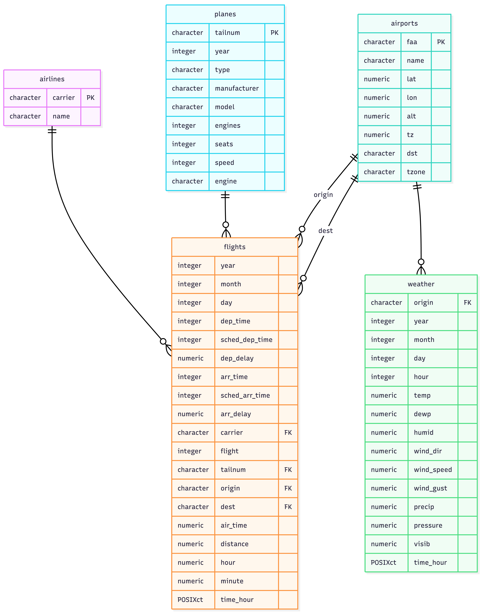

<style>
.title {
margin-bottom: 0; /* Reduces space below the title */
}
.author {
margin-top: 0; /* Reduces space above the author */
}
</style>

<div class="title">
<h1>SQL Exercises on Seattle and Portland Flights data</h1>
</div>
<div class="author">
<h3>Author: Dr. Chester Ismay</h3>
</div>


```{r setup, include=FALSE}
# shiny apps account logs in through GitHub (chester-ismay)

library(learnr)
suppressPackageStartupMessages(library(gradethis))
library(DBI)
library(RSQLite)
suppressPackageStartupMessages(library(tidyverse))

# Copy data over into this folder
# file.copy(from = "../flights2023/pnwflights23/data/airlines.rda",
#           to = "exercises/data/airlines.rda")
# file.copy(from = "../flights2023/pnwflights23/data/airports.rda",
#           to = "exercises/data/airports.rda")
# file.copy(from = "../flights2023/pnwflights23/data/flights.rda",
#           to = "exercises/data/flights.rda")
# file.copy(from = "../flights2023/pnwflights23/data/planes.rda",
#           to = "exercises/data/planes.rda")
# file.copy(from = "../flights2023/pnwflights23/data/weather.rda",
#           to = "exercises/data/weather.rda")

#setwd(paste0(getwd(), "/exercises"))

# Read data in from RDA files
load("data/airlines.rda")
load("data/airports.rda")
load("data/flights.rda")
load("data/planes.rda")
load("data/weather.rda")

## Create an ephemeral in-memory RSQLite database
con <- dbConnect(SQLite(), ":memory:")

# Write the new data to the database
dbWriteTable(con, "airlines", airlines, overwrite = TRUE)
dbWriteTable(con, "airports", airports, overwrite = TRUE)
dbWriteTable(con, "flights", flights, overwrite = TRUE)
dbWriteTable(con, "planes", planes, overwrite = TRUE)
dbWriteTable(con, "weather", weather, overwrite = TRUE)

knitr::opts_chunk$set(connection = "con", 
                      max.print = 500)
```


```{r setup2, echo=FALSE, out.width='100%', fig.align='center'}
tutorial_options(exercise.cap = "Query", 
                 exercise.eval = FALSE,
                 exercise.reveal_solution = TRUE)
```

```{r echo=FALSE}
library(DiagrammeR)
# https://github.com/bergant/datamodelr
library(datamodelr)

dm_f <- dm_from_data_frames(airlines, airports, flights, planes, weather)

dm_f <- dm_add_references(
  dm_f,
  
  flights$carrier == airlines$carrier,
  flights$origin == airports$faa,
  flights$dest == airports$faa,
  flights$tailnum == planes$tailnum,
  weather$origin == airports$faa
)

graph <- dm_create_graph(dm_f, rankdir = "BT", col_attr = c("column", "type"))

#dm_render_graph(graph)
```

```{r echo=FALSE}
build_mermaid_from_dm <- function(dm_obj, df_list, primary_keys = list()) {
  # Extract references
  refs <- dm_obj$references
  
  # Build FK lookup from references
  fk_cols <- list()
  
  for (i in seq_len(nrow(refs))) {
    ref_tbl <- refs$table[i]
    ref_col <- refs$column[i]
    fk_cols[[ref_tbl]] <- c(fk_cols[[ref_tbl]], ref_col)
  }
  
  fk_cols <- lapply(fk_cols, unique)
  
  # Build mermaid output
  lines <- "erDiagram"
  
  for (tbl_name in names(df_list)) {
    df <- df_list[[tbl_name]]
    lines <- c(lines, paste0("    ", tbl_name, " {"))
    
    for (col in names(df)) {
      col_type <- class(df[[col]])[1]
      
      key_marker <- ""
      if (col %in% primary_keys[[tbl_name]]) {
        key_marker <- " PK"
      } else if (col %in% fk_cols[[tbl_name]]) {
        key_marker <- " FK"
      }
      
      lines <- c(lines, paste0("        ", col_type, " ", col, key_marker))
    }
    
    lines <- c(lines, "    }")
  }
  
  # Add relationships
  for (i in seq_len(nrow(refs))) {
    ref_tbl <- refs$table[i]
    ref_col <- refs$column[i]
    pk_tbl <- refs$ref[i]
    
    label <- ""
    if (sum(refs$ref == pk_tbl & refs$table == ref_tbl) > 1) {
      label <- ref_col
    }
    
    lines <- c(lines, paste0('    ', pk_tbl, ' ||--o{ ', ref_tbl, ' : "', label, '"'))
  }
  
  paste(lines, collapse = "\n")
}

# Usage with explicit primary keys
mermaid_code <- build_mermaid_from_dm(
  dm_obj = dm_f,
  df_list = list(
    airlines = airlines,
    airports = airports,
    flights = flights,
    planes = planes,
    weather = weather
  ),
  primary_keys = list(
    airlines = "carrier",
    airports = "faa",
    planes = "tailnum"
  )
)

#cat(mermaid_code)
```

<details open>
<summary style="display: inline-block; padding: 8px 16px; background-color: #337ab7; color: white; border-radius: 4px; cursor: pointer; font-weight: bold;">Click to show/hide ER Diagram</summary>
<br><br>

</details>

<style>
.small-yellow-btn {
padding: 5px 10px; /* Adjust padding to reduce size */
font-size: 12px; /* Smaller font size */
border-radius: 5px; /* Adjust border radius for rounded corners */
background-color: yellow; /* Set background color to yellow */
color: black; /* Text color */
border: 1px solid darkgray; /* Optional: add border */
}
</style>

<style>
.hint-container {
margin-left: 40px; /* Adjust indentation as needed */
}
</style>

<br>

**Note that query results are limited to 500 records maximum to ensure the exercises run efficiently.**

# Selection Techniques

## Selecting columns/fields

1. Select all airline names from the `airlines` table.

```{sql query1, exercise=TRUE, exercise.eval=FALSE}
-- Write your SQL query here to select all airline names from the airlines table
```

```{sql query1-hint-1}
-- HINT: The syntax for selecting all columns from a table is:
SELECT ___
FROM ___;
```

```{sql query1-hint-2}
-- HINT: The syntax for selecting specific columns from airlines is:
SELECT ___
FROM airlines;
```

```{sql query1-solution}
-- SOLUTION: Here's one way to select all airline names from the airlines table
SELECT name
FROM airlines;
```

```{r query1-check, echo=FALSE}
grade_this({
  # Execute the solution query to get the correct result
  .solution <- DBI::dbGetQuery(con, .solution_code)
  
  # Execute the student's query
  .result <- DBI::dbGetQuery(con, .user_code)
  
  # Dynamically get expected columns from the solution
  cols_expected <- names(.solution)
  
  # Check for missing or extra columns
  missing_cols <- setdiff(cols_expected, names(.result))
  extra_cols <- setdiff(names(.result), cols_expected)
  
  if (length(missing_cols) > 0) {
    fail(glue::glue("Your query is missing the following columns: {toString(missing_cols)}."))
  }
  
  if (length(extra_cols) > 0) {
    fail(glue::glue("Your query should not include the following columns: {toString(extra_cols)}."))
  }
  
  # Check for matching row counts
  if (nrow(.result) != nrow(.solution)) {
    fail("The number of rows returned by your query does not match the expected result.")
  }
  
  # Check if all values in each column match, allowing for different row orders
  all_columns_match <- TRUE
  for (column in cols_expected) {
    if (!identical(sort(.result[[column]]), sort(.solution[[column]]))) {
      all_columns_match <- FALSE
      break
    }
  }
  
  if (!all_columns_match) {
    fail("The values returned by your query do not match the expected result in one or more columns.")
  }
  
  # If all checks pass
  pass("Your query appears to be correct.")
})
```


2. Select all columns from the `weather` table.

```{sql query2, exercise=TRUE, exercise.eval=FALSE}
-- Write your SQL query here to select all columns/fields from the weather table
```

```{sql query2-hint-1}
-- HINT: Use SELECT * to select all columns from a table.
SELECT *
___ ___;
```

```{sql query2-hint-2}
-- HINT: Use FROM to specify which table to pull all columns from.
SELECT *
FROM ___;
```

```{sql query2-solution}
-- SOLUTION: Here is one way to select all fields from the `weather` table:
SELECT *
FROM weather;
```

```{r query2-check, echo=FALSE}
grade_this({
  # Execute the solution query to get the correct result
  .solution_ex2 <- DBI::dbGetQuery(con, .solution_code)
  
  # Execute the student's query
  .result_ex2 <- DBI::dbGetQuery(con, .user_code)
  
  # Use the grading logic from EXERCISE 1, adapted for EXERCISE 2
  # Dynamically get expected columns from the solution for EXERCISE 2
  cols_expected_ex2 <- names(.solution_ex2)
  
  # Check for missing or extra columns
  missing_cols_ex2 <- setdiff(cols_expected_ex2, names(.result_ex2))
  extra_cols_ex2 <- setdiff(names(.result_ex2), cols_expected_ex2)
  
  if (length(missing_cols_ex2) > 0) {
    fail(glue::glue("Your query is missing the following columns: {toString(missing_cols_ex2)}."))
  }
  
  if (length(extra_cols_ex2) > 0) {
    fail(glue::glue("Your query should not include the following columns: {toString(extra_cols_ex2)}."))
  }
  
  # Check for matching row counts
  if (nrow(.result_ex2) != nrow(.solution_ex2)) {
    fail("The number of rows returned by your query does not match the expected result.")
  }
  
  # Check if all values in each column match, allowing for different row orders
  all_columns_match_ex2 <- TRUE
  for (column in cols_expected_ex2) {
    if (!identical(sort(.result_ex2[[column]]), sort(.solution_ex2[[column]]))) {
      all_columns_match_ex2 <- FALSE
      break
    }
  }
  
  if (!all_columns_match_ex2) {
    fail("The values returned by your query do not match the expected result in one or more columns.")
  }
  
  # If all checks pass
  pass("Your query appears to be correct.")
})
```

3. Select the FAA code and name from the `airports` table.

```{sql query3, exercise=TRUE, exercise.eval=FALSE}
-- Write your SQL query here to select the FAA code and name from the 
-- airports table
```

```{sql query3-hint-1}
-- HINT: The syntax for selecting specific columns from a table is:
SELECT ___, ___
FROM ___;
```

```{sql query3-hint-2}
-- HINT: You need to specify the columns and table you're selecting from:
SELECT faa, ___
FROM airports;
```

```{sql query3-solution}
-- SOLUTION: Here is one way to select the FAA code and name from the airports table:
SELECT faa, name
FROM airports;
```

```{r query3-check, echo=FALSE}
grade_this({
  # Execute the solution query to get the correct result
  .solution_ex3 <- DBI::dbGetQuery(con, .solution_code)
  
  # Execute the student's query
  .result_ex3 <- DBI::dbGetQuery(con, .user_code)
  
  # Dynamically get expected columns from the solution for EXERCISE 3
  cols_expected_ex3 <- names(.solution_ex3)
  
  # Check for missing or extra columns
  missing_cols_ex3 <- setdiff(cols_expected_ex3, names(.result_ex3))
  extra_cols_ex3 <- setdiff(names(.result_ex3), cols_expected_ex3)
  
  if (length(missing_cols_ex3) > 0) {
    fail(glue::glue("Your query is missing the following columns: {toString(missing_cols_ex3)}."))
  }
  
  if (length(extra_cols_ex3) > 0) {
    fail(glue::glue("Your query should not include the following columns: {toString(extra_cols_ex3)}."))
  }
  
  # Check for matching row counts
  if (nrow(.result_ex3) != nrow(.solution_ex3)) {
    fail("The number of rows returned by your query does not match the expected result.")
  }
  
  # Check if all values in each column match, allowing for different row orders
  all_columns_match_ex3 <- TRUE
  for (column in cols_expected_ex3) {
    if (!identical(sort(.result_ex3[[column]]), sort(.solution_ex3[[column]]))) {
      all_columns_match_ex3 <- FALSE
      break
    }
  }
  
  if (!all_columns_match_ex3) {
    fail("The values returned by your query do not match the expected result in one or more columns.")
  }
  
  # If all checks pass
  pass("Your query appears to be correct.")
})
```

## Aliasing

4. Select and alias specific columns from the airports table

```{sql query4, exercise=TRUE, exercise.eval=FALSE}
-- Write your SQL query here to select the FAA code, name, 
-- and alt from the airports table with aliases of 
-- code, airport_name, and altitude, respectively
```


```{sql query4-hint-1}
-- HINT: Start by selecting columns and use AS to give them aliases. For example:
SELECT column_name AS alias_name
FROM table_name;
```


```{sql query4-hint-2}
-- HINT: Your query should look something like this, fill in the blanks:
SELECT faa AS code, name AS ___, alt AS ___
FROM airports;
```


```{sql query4-solution}
-- SOLUTION: Here is how you can select and alias the FAA code, name, and altitude from the airports table:
SELECT faa AS code, name AS airport_name, alt AS altitude
FROM airports;
```


```{r query4-check, echo=FALSE}
grade_this({
  # Execute the solution query to get the correct result for EXERCISE 4
  .solution_ex4 <- DBI::dbGetQuery(con, "SELECT faa AS code, name AS airport_name, alt AS altitude FROM airports;")
  
  # Execute the student's query for EXERCISE 4
  .result_ex4 <- DBI::dbGetQuery(con, .user_code)
  
  # Dynamically get expected columns from the solution for EXERCISE 4
  cols_expected_ex4 <- names(.solution_ex4)
  
  # Check for missing or extra columns in the student's result
  missing_cols_ex4 <- setdiff(cols_expected_ex4, names(.result_ex4))
  extra_cols_ex4 <- setdiff(names(.result_ex4), cols_expected_ex4)
  
  if (length(missing_cols_ex4) > 0) {
    fail(glue::glue("Your query is missing the following columns: {toString(missing_cols_ex4)}."))
  }
  
  if (length(extra_cols_ex4) > 0) {
    fail(glue::glue("Your query should not include the following columns: {toString(extra_cols_ex4)}."))
  }
  
  # Check if the number of rows and values in each column match the solution
  if (nrow(.result_ex4) != nrow(.solution_ex4)) {
    fail("The number of rows returned by your query does not match the expected result.")
  }
  
  all_columns_match_ex4 <- TRUE
  for (column in cols_expected_ex4) {
    if (!identical(sort(.result_ex4[[column]]), sort(.solution_ex4[[column]]))) {
      all_columns_match_ex4 <- FALSE
      break
    }
  }
  
  if (!all_columns_match_ex4) {
    fail("The values returned by your query do not match the expected result in one or more columns.")
  }
  
  # If all checks pass
  pass("Your query appears to be correct.")
})
```

5. Choose the destination airport code and air time from the flights table with an alias `f`

```{sql query5, exercise=TRUE, exercise.eval=FALSE}
-- Write your SQL query here to select the destination airport code and 
-- air time from the flights table with an alias
```

```{sql query5-hint-1}
-- HINT: Use the SELECT statement to choose columns and AS to alias the table. For example:
SELECT column_name
FROM table_name AS table_alias;
```

```{sql query5-hint-2}
-- HINT: Your query should include the table alias and select specific columns like this:
SELECT f.dest, f.air_time
FROM flights AS f;
```

```{sql query5-solution}
-- SOLUTION: Here's how to select the destination airport code and air time from the flights table using an alias:
SELECT f.dest, f.air_time
FROM flights AS f;
```

```{r query5-check, echo=FALSE}
grade_this({
  # Execute the solution query to get the correct result for EXERCISE 5
  .solution_ex5 <- DBI::dbGetQuery(con, "SELECT dest, air_time FROM flights AS f;")
  
  # Execute the student's query for EXERCISE 5
  .result_ex5 <- DBI::dbGetQuery(con, .user_code)
  
  # Dynamically get expected columns from the solution for EXERCISE 5
  cols_expected_ex5 <- names(.solution_ex5)
  
  # Check for missing or extra columns in the student's result
  missing_cols_ex5 <- setdiff(cols_expected_ex5, names(.result_ex5))
  extra_cols_ex5 <- setdiff(names(.result_ex5), cols_expected_ex5)
  
  if (length(missing_cols_ex5) > 0) {
    fail(glue::glue("Your query is missing the following columns: {toString(missing_cols_ex5)}."))
  }
  
  if (length(extra_cols_ex5) > 0) {
    fail(glue::glue("Your query should not include the following columns: {toString(extra_cols_ex5)}."))
  }
  
  # Check if the number of rows and values in each column match the solution
  if (nrow(.result_ex5) != nrow(.solution_ex5)) {
    fail("The number of rows returned by your query does not match the expected result.")
  }
  
  all_columns_match_ex5 <- TRUE
  for (column in cols_expected_ex5) {
    if (!identical(sort(.result_ex5[[column]]), sort(.solution_ex5[[column]]))) {
      all_columns_match_ex5 <- FALSE
      break
    }
  }
  
  if (!all_columns_match_ex5) {
    fail("The values returned by your query do not match the expected result in one or more columns.")
  }
  
  # If all checks pass
  pass("Your query appears to be correct.")
})
```

## Unique entries


6. Select all distinct time zones (`tz`) from the `airports` table.

```{sql query6, exercise=TRUE, exercise.eval=FALSE}
-- Write your SQL query here to select all distinct time zones from
-- the airports table
```


```{sql query6-hint-1}
-- HINT: Use SELECT DISTINCT to get unique values from a column. For example:
SELECT DISTINCT column_name
FROM table_name;
```

```{sql query6-hint-2}
-- HINT: Fill in the blank with the appropriate column name:
SELECT DISTINCT ___
FROM airports;
```

```{sql query6-solution}
-- SOLUTION: Here's how to select all distinct time zones from the airports table:
SELECT DISTINCT tz
FROM airports;
```

```{r query6-check, echo=FALSE}
grade_this({
  # Execute the solution query to get the correct result for EXERCISE 6
  .solution_ex6 <- DBI::dbGetQuery(con, "SELECT DISTINCT tz FROM airports;")
  
  # Execute the student's query for EXERCISE 6
  .result_ex6 <- DBI::dbGetQuery(con, .user_code)
  
  # Expecting only the 'tz' column in the result
  cols_expected_ex6 <- names(.solution_ex6)
  
  # Check for missing or extra columns in the student's result
  missing_cols_ex6 <- setdiff(cols_expected_ex6, names(.result_ex6))
  extra_cols_ex6 <- setdiff(names(.result_ex6), cols_expected_ex6)
  
  if (length(missing_cols_ex6) > 0) {
    fail(glue::glue("Your query is missing the 'tz' column."))
  }
  
  if (length(extra_cols_ex6) > 0) {
    fail(glue::glue("Your query should not include columns other than 'tz'."))
  }
  
  # Check if the number of rows matches the solution
  if (nrow(.result_ex6) != nrow(.solution_ex6)) {
    fail("The number of distinct time zones returned by your query does not match the expected result.")
  }
  
  # If all checks pass
  pass("Your query correctly retrieves all distinct time zones from the airports table.")
})
```

<!--
## View creation

7. Create a view named `flight_details` to select carrier and destination from the flights table

```{sql query7, exercise=TRUE, exercise.eval=FALSE}
-- Write your SQL query here to create a view that selects the carrier
-- and destination from the flights table
```

```{sql query7-hint-1}
-- HINT: To create a view, use the CREATE VIEW statement followed by SELECT. For example:
CREATE VIEW view_name AS
SELECT column1, column2
FROM table_name;
```

```{sql query7-hint-2}
-- HINT: Define the view to include the carrier and destination columns from the flights table:
CREATE VIEW flight_details AS
SELECT ___, ___
FROM ___;
```

```{sql query7-solution}
-- SOLUTION: Here's how to create a view for carrier and destination from the flights table:
CREATE VIEW flight_details AS
SELECT carrier, dest
FROM flights;
```

```{r query7-check, echo=FALSE}
grade_this({
  # Pre-check cleanup: Drop existing views, especially 'flight_details'
  existing_views_df <- DBI::dbGetQuery(con, "SELECT name FROM sqlite_master WHERE type = 'view';")
  if (nrow(existing_views_df) > 0) {
    for (view in existing_views_df$name) {
      DBI::dbExecute(con, paste0("DROP VIEW IF EXISTS ", view, ";"))
    }
  }
  
  # Attempt to create the view as per the student's submission
  # Note: This step assumes that the student's code is attempting to create the view
  # and that executing it will not result in errors.
  # If the student's code is incorrect, you might need additional error handling here.
  
  # Attempt to create the view with detailed error reporting
  error_message <- NULL
  tryCatch({
    dbExecute(con, .user_code)
  }, error = function(e) {
    error_message <<- e$message
    fail(glue::glue("Error in creating the view: {error_message}"))
  })
  
  if (!is.null(error_message)) {
    fail(glue::glue("Error in creating the view: {error_message}"))
  }
  
  # Check if the view was created successfully
  views <- dbListTables(con)
  if (!"flight_details" %in% views) {
    fail("The view 'flight_details' was not created. Make sure your SQL statement uses the CREATE VIEW syntax.")
  }

  # If the view exists, validate its structure
  .result_view <- dbGetQuery(con, "SELECT * FROM flight_details LIMIT 0;")
  cols_expected_view <- c("carrier", "dest")
  
  missing_cols_view <- setdiff(cols_expected_view, names(.result_view))
  extra_cols_view <- setdiff(names(.result_view), cols_expected_view)
  
  if (length(missing_cols_view) > 0) {
    fail(glue("The view 'flight_details' is missing the expected columns: {toString(missing_cols_view)}."))
  }
  
  if (length(extra_cols_view) > 0) {
    fail(glue("The view 'flight_details' includes unexpected columns: {toString(extra_cols_view)}."))
  }
  
  # Cleanup: Drop the 'flight_details' view to clean up the database after grading
  on.exit({
    dbExecute(con, "DROP VIEW IF EXISTS flight_details;")
  }, add = TRUE)
  
  # If all checks pass
  pass("The view 'flight_details' was created successfully with the correct structure.")
})
```

```{r old, echo=FALSE, eval=FALSE}
grade_this({
  # Pre-check cleanup: Drop existing views, especially 'flight_details'
  existing_views_df <- DBI::dbGetQuery(con, "SELECT name FROM sqlite_master WHERE type = 'view';")
  if (nrow(existing_views_df) > 0) {
    for (view in existing_views_df$name) {
      DBI::dbExecute(con, paste0("DROP VIEW IF EXISTS ", view, ";"))
    }
  }
  
  # Check if the view exists
  views <- dbListTables(con)
  if (!"flight_details" %in% views) {
    fail("The view 'flight_details' was not created.")
  } else {
    # If the view exists, check its structure
    .result_view <- DBI::dbGetQuery(con, "SELECT * FROM flight_details LIMIT 0;")
    cols_expected_view <- c("carrier", "dest")
    
    missing_cols_view <- setdiff(cols_expected_view, names(.result_view))
    extra_cols_view <- setdiff(names(.result_view), cols_expected_view)
    
    if (length(missing_cols_view) > 0) {
      fail(glue::glue("The view 'flight_details' is missing the following columns: {toString(missing_cols_view)}."))
    }
    
    if (length(extra_cols_view) > 0) {
      fail(glue::glue("The view 'flight_details' should not include the following columns: {toString(extra_cols_view)}."))
    }
    
    # If all checks pass, pass the check
    pass("The view 'flight_details' was created successfully with the correct structure.")
  }
  
  # Cleanup: Identify and drop all views
  on.exit({
    # Query the sqlite_master table to list all views
    views_df <- DBI::dbGetQuery(con, "SELECT name FROM sqlite_master WHERE type = 'view';")

    if (nrow(views_df) > 0) {
      views_to_drop <- views_df$name

      # Drop each identified view
      for (view in views_to_drop) {
        DBI::dbExecute(con, paste0("DROP VIEW IF EXISTS ", view, ";"))
      }
    }
  }, add = TRUE)
})
```

8. Select all columns from the `flight_details` View

    *NOTE:* Unfortunately, I couldn't figure out a way to get the `flight_details` view to work in the SQL query. I tried to use the `CREATE VIEW` statement to create the view, but it didn't work. Thus, I'm just showing the results of the query that would have been used to create the view.

```{sql query8-solution, eval=FALSE}
-- SOLUTION: Here's how to select all columns from the flight_details view:
SELECT * 
FROM flight_details;
```

```{sql echo=FALSE}
SELECT carrier, dest
FROM flights;
```

```{r old-query8-check, echo=FALSE, eval=FALSE}
grade_this({
  # Drop the 'flight_details' view if it exists to ensure a clean setup
  DBI::dbExecute(con, "DROP VIEW IF EXISTS flight_details;")

  # Recreate the 'flight_details' view with the correct structure
  DBI::dbExecute(con, "CREATE VIEW flight_details AS SELECT carrier, dest FROM flights;")
  
  # Execute the solution query to get the correct result for EXERCISE 8
  .solution_ex8 <- DBI::dbGetQuery(con, "SELECT * FROM flight_details;")
  
  # Execute the student's query for EXERCISE 8
  .result_ex8 <- DBI::dbGetQuery(con, .user_code)
  
  # Since the view 'flight_details' structure is predefined, we expect all its columns
  cols_expected_ex8 <- names(.solution_ex8)
  
  # Check for missing or extra columns in the student's result
  missing_cols_ex8 <- setdiff(cols_expected_ex8, names(.result_ex8))
  extra_cols_ex8 <- setdiff(names(.result_ex8), cols_expected_ex8)
  
  if (length(missing_cols_ex8) > 0) {
    fail(glue::glue("Your query is missing columns from the 'flight_details' view."))
  }
  
  if (length(extra_cols_ex8) > 0) {
    fail(glue::glue("Your query should not include extra columns not present in the 'flight_details' view."))
  }
  
  # Check if the number of rows matches the solution
  if (nrow(.result_ex8) != nrow(.solution_ex8)) {
    fail("The number of rows returned by your query does not match the expected result.")
  }
  
  # If all checks pass
  pass("Your query correctly retrieves all columns from the 'flight_details' view.")
})
```

-->

## Counting

7. Count the records in the flights table (aliased as `total_flights`)


```{sql query9, exercise=TRUE, exercise.eval=FALSE}
-- Write your SQL query here to count all records in the flights table
```

```{sql query9-hint-1}
-- HINT: Use the COUNT() function to count the number of records. For example:
SELECT COUNT(*) AS alias
FROM table_name;
```


```{sql query9-hint-2}
-- HINT: Apply the COUNT() function to the flights table to count all its records:
SELECT ___ AS ___
FROM ___;
```


```{sql query9-solution}
-- SOLUTION: Here's how to count all records in the flights table:
SELECT COUNT(*) AS total_flights
FROM flights;
```


```{r query9-check, echo=FALSE}
grade_this({
  # Execute the solution query to get the correct result for EXERCISE 9
  .solution_ex9 <- DBI::dbGetQuery(con, "SELECT COUNT(*) AS total_flights FROM flights;")
  
  # Execute the student's query for EXERCISE 9
  .result_ex9 <- DBI::dbGetQuery(con, .user_code)
  
  # Expecting a single column named 'total_flights' in the result
  cols_expected_ex9 <- names(.solution_ex9)
  
  # Check for missing or extra columns in the student's result
  missing_cols_ex9 <- setdiff(cols_expected_ex9, names(.result_ex9))
  extra_cols_ex9 <- setdiff(names(.result_ex9), cols_expected_ex9)
  
  if (length(missing_cols_ex9) > 0) {
    fail(glue::glue("Your query is missing the 'total_flights' column."))
  }
  
  if (length(extra_cols_ex9) > 0) {
    fail(glue::glue("Your query should not include extra columns not present in the expected result."))
  }
  
  # Check if the count value matches the solution
  if (.result_ex9$total_flights != .solution_ex9$total_flights) {
    fail("The total count of flights returned by your query does not match the expected result.")
  }
  
  # If all checks pass
  pass("Your query correctly counts all records in the flights table.")
})
```

8. Count all distinct carriers in the flights table as `total_distinct_carriers`

```{sql query10, exercise=TRUE, exercise.eval=FALSE}
-- Write your SQL query here to count all distinct carriers in the flights table
```

```{sql query10-hint-1}
-- HINT: To count unique values from a column, use
SELECT COUNT(DISTINCT column) AS alias
FROM table_name;
```

```{sql query10-hint-2}
-- HINT: Fill in the blank to complete the query for counting distinct carriers.
SELECT COUNT(DISTINCT ___) AS ___
FROM flights;
```

```{sql query10-solution}
-- SOLUTION: This query counts all distinct carriers in the flights table.
SELECT COUNT(DISTINCT carrier) AS total_distinct_carriers
FROM flights;
```

```{r query10-check, echo=FALSE}
grade_this({
  # Execute the solution query to get the correct result for EXERCISE 10
  .solution_ex10 <- DBI::dbGetQuery(con, "SELECT COUNT(DISTINCT carrier) AS total_distinct_carriers FROM flights;")
  
  # Execute the student's query for EXERCISE 10
  .result_ex10 <- DBI::dbGetQuery(con, .user_code)
  
  # Expecting a single column named 'total_distinct_carriers' in the result
  cols_expected_ex10 <- names(.solution_ex10)
  
  # Check for missing or extra columns in the student's result
  missing_cols_ex10 <- setdiff(cols_expected_ex10, names(.result_ex10))
  extra_cols_ex10 <- setdiff(names(.result_ex10), cols_expected_ex10)
  
  if (length(missing_cols_ex10) > 0) {
    fail(glue::glue("Your query is missing the 'total_distinct_carriers' column."))
  }
  
  if (length(extra_cols_ex10) > 0) {
    fail(glue::glue("Your query should not include extra columns not present in the expected result."))
  }
  
  # Check if the count value matches the solution
  if (.result_ex10$total_distinct_carriers != .solution_ex10$total_distinct_carriers) {
    fail("The total count of distinct carriers returned by your query does not match the expected result.")
  }
  
  # If all checks pass
  pass("Your query correctly counts all distinct carriers in the flights table.")
})
```

# Filtering Techniques

## Filtering rows/records

9. Select Boeing Planes' Tail Numbers and Models

```{sql query11, exercise=TRUE, exercise.eval=FALSE}
-- Write your SQL query here to select tail numbers and models 
-- of all Boeing planes.
```

```{sql query11-hint-1}
-- HINT: Use a WHERE clause to filter for specific conditions. Syntax example:
SELECT column1, column2 
FROM table_name 
WHERE condition;
```

```{sql query11-hint-2}
-- HINT: Fill in the blanks to select tail numbers and models from the planes table for Boeing planes.
SELECT ___, ___ 
FROM planes 
WHERE manufacturer = '___';
```

```{sql query11-solution}
-- SOLUTION: This query selects tail numbers and models of planes manufactured by Boeing.
SELECT tailnum, model 
FROM planes 
WHERE manufacturer = 'BOEING';
```

```{r query11-check, echo=FALSE}
grade_this({
  .solution_query11 <- "SELECT tailnum, model FROM planes WHERE manufacturer = 'BOEING';"
  .solution_ex11 <- DBI::dbGetQuery(con, .solution_query11)
  .result_ex11 <- DBI::dbGetQuery(con, .user_code)
  
  # Check for missing or extra columns in the student's result
  cols_expected_ex11 <- names(.solution_ex11)
  missing_cols_ex11 <- setdiff(cols_expected_ex11, names(.result_ex11))
  extra_cols_ex11 <- setdiff(names(.result_ex11), cols_expected_ex11)
  
  if (length(missing_cols_ex11) > 0) {
    fail(glue::glue("Your query is missing the following columns: {toString(missing_cols_ex11)}."))
  }
  
  if (length(extra_cols_ex11) > 0) {
    fail(glue::glue("Your query includes extra columns not expected: {toString(extra_cols_ex11)}."))
  }
  
  # Check row count matches
  if (nrow(.result_ex11) != nrow(.solution_ex11)) {
    fail("The number of rows returned by your query does not match the expected result. Ensure you're filtering for Boeing planes correctly.")
  }
  
  # Check the correctness of the result (bidirectional)
  if (!all(.result_ex11$tailnum %in% .solution_ex11$tailnum) || !all(.solution_ex11$tailnum %in% .result_ex11$tailnum)) {
    fail("The tail numbers and/or models returned by your query do not match the expected result. Ensure you're filtering for Boeing planes.")
  }
  
  pass("Correct! Your query successfully retrieved tail numbers and models of Boeing planes.")
})
```

10. Select airports (faa, name, lat) above 40 latitude and in the America/New_York time zone.

```{sql query12, exercise=TRUE, exercise.eval=FALSE}
-- Write your SQL query here to select airports that meet specific criteria.
```

```{sql query12-hint-1}
-- HINT: Use WHERE to filter records based on conditions. Remember to use AND for multiple conditions.
SELECT column1, column2, column3 
FROM table_name 
WHERE condition1 AND condition2;
```

```{sql query12-hint-2}
-- HINT: Complete the query to select certain airports. Fill in the blanks appropriately.
SELECT ___, ___, ___ 
FROM airports 
WHERE ___ > ___ 
AND ___ = '___';
```

```{sql query12-solution}
-- SOLUTION: This query selects certain columns from airports based on specified conditions.
SELECT faa, name, lat 
FROM airports 
WHERE lat > 40 
AND tzone = 'America/New_York';
```

```{r query12-check, echo=FALSE}
grade_this({
  .solution_query12 <- "SELECT faa, name, lat FROM airports WHERE lat > 40 AND tzone = 'America/New_York';"
  .solution_ex12 <- DBI::dbGetQuery(con, .solution_query12)
  .result_ex12 <- DBI::dbGetQuery(con, .user_code)
  
  # Check for missing or extra columns in the student's result
  cols_expected_ex12 <- names(.solution_ex12)
  missing_cols_ex12 <- setdiff(cols_expected_ex12, names(.result_ex12))
  extra_cols_ex12 <- setdiff(names(.result_ex12), cols_expected_ex12)
  
  if (length(missing_cols_ex12) > 0) {
    fail(glue::glue("Your query is missing the following columns: {toString(missing_cols_ex12)}."))
  }
  
  if (length(extra_cols_ex12) > 0) {
    fail(glue::glue("Your query includes extra columns not expected: {toString(extra_cols_ex12)}."))
  }
  
  # Check row count matches
  if (nrow(.result_ex12) != nrow(.solution_ex12)) {
    fail("The number of rows returned by your query does not match the expected result. Ensure your conditions are correct.")
  }
  
  # Validate the correctness of the result (bidirectional check)
  if (!all(.result_ex12$faa %in% .solution_ex12$faa) || !all(.solution_ex12$faa %in% .result_ex12$faa)) {
    fail("The FAA codes returned by your query do not match the expected result. Ensure your conditions are correct.")
  }
  
  pass("Correct! Your query successfully retrieved the required information from the airports table based on the specified conditions.")
})
```

11. Select airports (faa code, name, and lat) within 40 to 42 degrees latitude.

```{sql query13, exercise=TRUE, exercise.eval=FALSE}
-- Write your SQL query here to select airports within a specific latitude range
```

```{sql query13-hint-1}
-- HINT: Use BETWEEN to filter records within a range. Example syntax:
SELECT column1, column2 
FROM table_name 
WHERE column3 BETWEEN value1 AND value2;
```

```{sql query13-hint-2}
-- HINT: Complete this query to select airports based on their latitude. Remember to fill in the blanks:
SELECT ___, ___, ___ 
FROM airports 
WHERE lat BETWEEN ___ AND ___;
```

```{sql query13-solution}
-- SOLUTION: This query selects FAA codes, names, and latitudes of airports within a specific latitude range.
SELECT faa, name, lat 
FROM airports 
WHERE lat BETWEEN 40 AND 42;
```

```{r query13-check, echo=FALSE}
grade_this({
  .solution_query13 <- "SELECT faa, name, lat FROM airports WHERE lat BETWEEN 40 AND 42;"
  .solution_ex13 <- DBI::dbGetQuery(con, .solution_query13)
  .result_ex13 <- DBI::dbGetQuery(con, .user_code)
  
  # Check for missing or extra columns in the student's result
  cols_expected_ex13 <- names(.solution_ex13)
  missing_cols_ex13 <- setdiff(cols_expected_ex13, names(.result_ex13))
  extra_cols_ex13 <- setdiff(names(.result_ex13), cols_expected_ex13)
  
  if (length(missing_cols_ex13) > 0) {
    fail(glue::glue("Your query is missing the following columns: {toString(missing_cols_ex13)}."))
  }
  
  if (length(extra_cols_ex13) > 0) {
    fail(glue::glue("Your query includes extra columns not expected: {toString(extra_cols_ex13)}."))
  }
  
  # Check row count matches
  if (nrow(.result_ex13) != nrow(.solution_ex13)) {
    fail("The number of rows returned by your query does not match the expected result. Ensure your latitude range is correct.")
  }
  
  # Validate the correctness of the result (bidirectional check)
  if (!all(.result_ex13$faa %in% .solution_ex13$faa) || !all(.solution_ex13$faa %in% .result_ex13$faa)) {
    fail("The FAA codes returned by your query do not match the expected result. Ensure your latitude range is correct.")
  }
  
  pass("Correct! Your query successfully retrieved the required information from the airports table based on the specified latitude range.")
})
```

## Filtering text

12. Select airlines (carrier code and name) with name starting with an "A"

```{sql query14, exercise=TRUE, exercise.eval=FALSE}
-- Write your SQL query here to select airlines with names starting with a 
-- specific letter.
```

```{sql query14-hint-1}
-- HINT: Use LIKE to filter records based on a pattern. Example syntax:
SELECT column1 
FROM table_name 
WHERE column1 LIKE 'pattern%';
```

```{sql query14-hint-2}
-- HINT: Complete this query to select airlines based on the starting letter of their names. Remember to fill in the blanks:
SELECT ___, ___ 
FROM airlines 
WHERE name LIKE '___%';
```

```{sql query14-solution}
-- SOLUTION: This query selects the carrier code and name of airlines with names starting with 'A'.
SELECT carrier, name 
FROM airlines 
WHERE name LIKE 'A%';
```

```{r query14-check, echo=FALSE}
grade_this({
  .solution_query14 <- "SELECT carrier, name FROM airlines WHERE name LIKE 'A%';"
  .solution_ex14 <- DBI::dbGetQuery(con, .solution_query14)
  .result_ex14 <- DBI::dbGetQuery(con, .user_code)
  
  # Check for missing or extra columns in the student's result
  cols_expected_ex14 <- names(.solution_ex14)
  missing_cols_ex14 <- setdiff(cols_expected_ex14, names(.result_ex14))
  extra_cols_ex14 <- setdiff(names(.result_ex14), cols_expected_ex14)
  
  if (length(missing_cols_ex14) > 0) {
    fail(glue::glue("Your query is missing the following columns: {toString(missing_cols_ex14)}."))
  }
  
  if (length(extra_cols_ex14) > 0) {
    fail(glue::glue("Your query includes extra columns not expected: {toString(extra_cols_ex14)}."))
  }
  
  # Check if the number of rows matches the solution
  if (nrow(.result_ex14) != nrow(.solution_ex14)) {
    fail("The number of rows returned by your query does not match the expected result. This may indicate an incorrect LIKE pattern or other issues in your WHERE clause.")
  }
  
  # Validate the correctness of the result
  if (!all(.result_ex14$carrier %in% .solution_ex14$carrier)) {
    fail("The carrier codes returned by your query do not match the expected result. Ensure your LIKE pattern is correct.")
  }
  
  pass("Correct! Your query successfully retrieved the required information from the airlines table based on the specified pattern.")
})
```

13. Select flights having 101 as the second, third, and fourth characters of the tail number.

```{sql query15, exercise=TRUE, exercise.eval=FALSE}
-- Write your SQL query here to select flights with tail numbers matching 
-- a specific pattern.
```

```{sql query15-hint-1}
-- HINT: Use LIKE with underscores (_) to represent single characters in a pattern. For example:
SELECT column 
FROM table_name 
WHERE column LIKE '_pattern%';
```

```{sql query15-hint-2}
-- HINT: Fill in the blanks to complete the query for selecting flights by their tail number pattern.
SELECT ___ 
FROM flights 
WHERE tailnum LIKE '_pattern%';
```

```{sql query15-solution}
-- SOLUTION: This query selects flights with tail numbers that have '101' as the second, third, and fourth characters.
SELECT tailnum 
FROM flights 
WHERE tailnum LIKE '_101%';
```

```{r query15-check, echo=FALSE}
grade_this({
  # Execute the solution query to get the correct result for EXERCISE 15
  .solution_ex15 <- DBI::dbGetQuery(con, "SELECT tailnum FROM flights WHERE tailnum LIKE '_101%';")
  
  # Execute the student's query for EXERCISE 15
  .result_ex15 <- DBI::dbGetQuery(con, .user_code)
  
  # Expecting only the 'tailnum' column in the result
  cols_expected_ex15 <- names(.solution_ex15)
  
  # Check for missing or extra columns in the student's result
  missing_cols_ex15 <- setdiff(cols_expected_ex15, names(.result_ex15))
  extra_cols_ex15 <- setdiff(names(.result_ex15), cols_expected_ex15)
  
  if (length(missing_cols_ex15) > 0) {
    fail(glue::glue("Your query is missing the 'tailnum' column."))
  }
  
  if (length(extra_cols_ex15) > 0) {
    fail(glue::glue("Your query should not include extra columns not present in the expected result."))
  }
  
  # Check row count matches
  if (nrow(.result_ex15) != nrow(.solution_ex15)) {
    fail("The number of rows returned by your query does not match the expected result. Check your LIKE pattern.")
  }
  
  # Check if the result set matches the expected pattern (101 at positions 2,3,4)
  if (!all(grepl('^.101', .result_ex15$tailnum))) {
    fail("The tail numbers returned by your query do not match the expected pattern.")
  }
  
  # If all checks pass
  pass("Your query correctly retrieves flights based on the specified tail number pattern.")
})
```

14. Select flights (all columns) where the carrier is either "AS" or "HA"

```{sql query16, exercise=TRUE, exercise.eval=FALSE}
-- Write your SQL query here to select flights where the carrier is either 
-- "AS" or "HA".
```

```{sql query16-hint-1}
-- HINT: Use the IN operator to specify multiple possible values for a column. Example syntax:
SELECT * 
FROM table_name 
WHERE column_name IN ('value1', 'value2');
```

```{sql query16-hint-2}
-- HINT: Complete this query to select flights from specific carriers. Remember to fill in the blanks:
SELECT ___ 
FROM flights 
WHERE carrier IN ('___', '___');
```

```{sql query16-solution}
-- SOLUTION: This query selects all flights where the carrier is either "AS" or "HA".
SELECT * 
FROM flights 
WHERE carrier IN ('AS', 'HA');
```

```{r query16-check, echo=FALSE}
grade_this({
  .solution_query16 <- "SELECT * FROM flights WHERE carrier IN ('AS', 'HA');"
  .solution_ex16 <- DBI::dbGetQuery(con, .solution_query16)
  .result_ex16 <- DBI::dbGetQuery(con, .user_code)
  
  # Check for missing or extra columns in the student's result
  cols_expected_ex16 <- names(.solution_ex16)
  missing_cols_ex16 <- setdiff(cols_expected_ex16, names(.result_ex16))
  extra_cols_ex16 <- setdiff(names(.result_ex16), cols_expected_ex16)
  
  if (length(missing_cols_ex16) > 0) {
    fail(glue::glue("Your query is missing the following columns: {toString(missing_cols_ex16)}. Ensure you are selecting all columns with '*'."))
  }
  
  if (length(extra_cols_ex16) > 0) {
    fail(glue::glue("Your query includes extra columns not expected: {toString(extra_cols_ex16)}. Ensure you are not adding additional columns beyond '*'."))
  }
  
  # Check for matching carriers in the student's result
  valid_carriers_ex16 <- c("AS", "HA")
  if (!all(.result_ex16$carrier %in% valid_carriers_ex16)) {
    fail("The carriers returned by your query do not match the expected carriers 'AS' or 'HA'.")
  }
  
  # If the carriers match, ensure no additional filtering has excluded records unintentionally
  if (nrow(.result_ex16) != nrow(.solution_ex16)) {
    fail("The number of records returned by your query does not match the expected number of records for carriers 'AS' or 'HA'.")
  }
  
  pass("Your query correctly retrieves all flights where the carrier is either 'AS' or 'HA', including all appropriate columns.")
})
```

15. Select weather records (all columns) where wind direction is missing

```{sql query17, exercise=TRUE, exercise.eval=FALSE}
-- Write your SQL query here to select weather records where the 
-- wind direction is missing.
```

```{sql query17-hint-1}
-- HINT: Use IS NULL to check for missing values in a column. Example syntax:
SELECT * 
FROM table_name 
WHERE column_name IS NULL;
```

```{sql query17-hint-2}
-- HINT: Complete this query to select records with missing information. Remember to fill in the blanks:
SELECT ___ 
FROM weather 
WHERE ___ IS NULL;
```

```{sql query17-solution}
-- SOLUTION: This query selects all weather records where the wind direction is missing.
SELECT * 
FROM weather 
WHERE wind_dir IS NULL;
```

```{r query17-check, echo=FALSE}
grade_this({
  .solution_query17 <- "SELECT * FROM weather WHERE wind_dir IS NULL;"
  .solution_ex17 <- DBI::dbGetQuery(con, .solution_query17)
  .result_ex17 <- DBI::dbGetQuery(con, .user_code)
  
    # Check for missing or extra columns in the student's result
  cols_expected_ex17 <- names(.solution_ex17)
  missing_cols_ex17 <- setdiff(cols_expected_ex17, names(.result_ex17))
  extra_cols_ex17 <- setdiff(names(.result_ex17), cols_expected_ex17)
  
  if (length(missing_cols_ex17) > 0) {
    fail(glue::glue("Your query is missing the following columns: {toString(missing_cols_ex17)}. Ensure you are selecting all columns with '*'."))
  }
  
  # Check for missing wind_dir in the student's result
  if (!all(is.na(.result_ex17$wind_dir))) {
    fail("Not all records in your query result have missing wind direction.")
  }
  
  # Ensure no additional records are included or excluded unintentionally
  if (nrow(.result_ex17) != nrow(.solution_ex17)) {
    fail("The number of records returned by your query does not match the expected number of records with missing wind direction.")
  }
  
  pass("Your query correctly retrieves all weather records where the wind direction is missing.")
})
```

16. Select weather records where temperature is not missing

```{sql query18, exercise=TRUE, exercise.eval=FALSE}
-- Write your SQL query here to select weather records where the temperature 
-- is not missing.
```

```{sql query18-hint-1}
-- HINT: Use IS NOT NULL to check for non-missing values in a column. Example syntax:
SELECT * 
FROM table_name 
WHERE column_name IS NOT NULL;
```

```{sql query18-hint-2}
-- HINT: Complete this query to select records with available temperature information. Remember to fill in the blanks:
SELECT ___ 
FROM weather 
WHERE ___ IS NOT NULL;
```

```{sql query18-solution}
-- SOLUTION: This query selects all weather records where the temperature is not missing.
SELECT * 
FROM weather 
WHERE temp IS NOT NULL;
```

```{r query18-check, echo=FALSE}
grade_this({
  .solution_query18 <- "SELECT * FROM weather WHERE temp IS NOT NULL;"
  .solution_ex18 <- DBI::dbGetQuery(con, .solution_query18)
  .result_ex18 <- DBI::dbGetQuery(con, .user_code)
  
      # Check for missing or extra columns in the student's result
  cols_expected_ex18 <- names(.solution_ex18)
  missing_cols_ex18 <- setdiff(cols_expected_ex18, names(.result_ex18))
  extra_cols_ex18 <- setdiff(names(.result_ex18), cols_expected_ex18)
  
  if (length(missing_cols_ex18) > 0) {
    fail(glue::glue("Your query is missing the following columns: {toString(missing_cols_ex18)}. Ensure you are selecting all columns with '*'."))
  }
  
  # Check for non-missing temp in the student's result
  if (!all(!is.na(.result_ex18$temp))) {
    fail("Some records in your query result have missing temperature.")
  }
  
  # Ensure no additional records are included or excluded unintentionally
  if (nrow(.result_ex18) != nrow(.solution_ex18)) {
    fail("The number of records returned by your query does not match the expected number of records with non-missing temperature.")
  }
  
  pass("Your query correctly retrieves all weather records where the temperature is not missing.")
})
```

# Aggregating Techniques

## Numerical summaries

17. Calculate the average temperature from the weather table as `avg_temperature`

```{sql query19, exercise=TRUE, exercise.eval=FALSE}
-- Write your SQL query here to calculate the average temperature from 
-- the weather table.
```

```{sql query19-hint-1}
-- HINT: Use AVG() function to calculate the average of a column. Example syntax:
SELECT AVG(column_name) AS alias
FROM table_name;
```

```{sql query19-hint-2}
-- HINT: Complete this query to calculate the average temperature. Remember to fill in the blanks:
SELECT AVG(___ ) AS ___
FROM weather;
```

```{sql query19-solution}
-- SOLUTION: This query calculates the average temperature from the weather table.
SELECT AVG(temp) AS avg_temperature
FROM weather;
```

```{r query19-check, echo=FALSE}
grade_this({
  .solution_query19 <- "SELECT AVG(temp) AS avg_temperature FROM weather;"
  .solution_ex19 <- DBI::dbGetQuery(con, .solution_query19)
  .result_ex19 <- DBI::dbGetQuery(con, .user_code)
  
  # Check for the 'avg_temperature' column in the student's result
  if (!"avg_temperature" %in% names(.result_ex19)) {
    fail("Your query is missing the 'avg_temperature' column.")
  }
  
  # Ensure the calculated average matches the solution
  if (abs(.result_ex19$avg_temperature - .solution_ex19$avg_temperature) > 1e-2) {
    fail("The average temperature returned by your query does not match the expected average temperature.")
  }
  
  pass("Your query correctly calculates the average temperature from the weather table.")
})
```

18. Find the maximum arrival time for flights destined to ORD as `max_arr_time`

```{sql query20, exercise=TRUE, exercise.eval=FALSE}
-- Write your SQL query here to find the maximum arrival time for flights 
-- destined to ORD (Chicago O'Hare).
```

```{sql query20-hint-1}
-- HINT: Use MAX() function to find the maximum value of a column. Syntax example:
SELECT MAX(column_name) AS alias
FROM table_name
WHERE condition;
```

```{sql query20-hint-2}
-- HINT: Fill in the blanks to complete the query for finding the maximum arrival time to ORD:
SELECT MAX(___) AS ___
FROM flights
WHERE dest = 'ORD';
```

```{sql query20-solution}
-- SOLUTION: This query finds the maximum arrival time for flights destined to ORD.
SELECT MAX(arr_time) AS max_arr_time
FROM flights
WHERE dest = 'ORD';
```

```{r query20-check, echo=FALSE}
grade_this({
  .solution_query20 <- "SELECT MAX(arr_time) AS max_arr_time FROM flights WHERE dest = 'ORD';"
  .solution_ex20 <- DBI::dbGetQuery(con, .solution_query20)
  .result_ex20 <- DBI::dbGetQuery(con, .user_code)
  
  # Check for the 'max_arr_time' column in the student's result
  if (!"max_arr_time" %in% names(.result_ex20)) {
    fail("Your query is missing the 'max_arr_time' column.")
  }
  
  # Ensure the maximum arrival time matches the solution
  if (.result_ex20$max_arr_time != .solution_ex20$max_arr_time) {
    fail("The maximum arrival time returned by your query does not match the expected maximum arrival time.")
  }
  
  pass("Your query correctly finds the maximum arrival time for flights destined to ORD.")
})
```

## Categorical summaries

19. Find the first destination alphabetically for flights from SEA as `first_sea_dest`

```{sql query21, exercise=TRUE, exercise.eval=FALSE}
-- Write your SQL query here to find the first destination alphabetically 
-- for flights from SEA.
```

```{sql query21-hint-1}
-- HINT: Use MIN() function to find the minimum (first alphabetically) value of a column. Syntax example:
SELECT MIN(column_name) AS alias
FROM table_name
WHERE condition;
```

```{sql query21-hint-2}
-- HINT: Complete this query to find the first destination alphabetically where flights are destined to SEA. Fill in the blanks:
SELECT MIN(___) AS first_sea_dest
FROM flights
WHERE origin = 'SEA';
```

```{sql query21-solution}
-- SOLUTION: This query finds the first destination alphabetically for flights destined to SEA.
SELECT MIN(dest) AS first_sea_dest
FROM flights
WHERE origin = 'SEA';
```

```{r query21-check, echo=FALSE}
grade_this({
  .solution_query21 <- "SELECT MIN(dest) AS first_sea_dest FROM flights WHERE origin = 'SEA';"
  .solution_ex21 <- DBI::dbGetQuery(con, .solution_query21)
  .result_ex21 <- DBI::dbGetQuery(con, .user_code)
  
  # Check for the 'first_sea_dest' column in the student's result
  if (!"first_sea_dest" %in% names(.result_ex21)) {
    fail("Your query is missing the 'first_sea_dest' column.")
  }
  
  # Ensure the first destination alphabetically matches the solution
  if (.result_ex21$first_sea_dest != .solution_ex21$first_sea_dest) {
    fail("The first destination alphabetically returned by your query does not match the expected first destination.")
  }
  
  pass("Your query correctly finds the first destination alphabetically for flights from SEA.")
})
```

## Rounding summaries

20. Round wind gust values in the weather table to 0 decimal places as `rounded_wind_gust`

```{sql query22, exercise=TRUE, exercise.eval=FALSE}
-- Write your SQL query here to round wind gust values in the weather 
-- table to 0 decimal places.
```

```{sql query22-hint-1}
-- HINT: Use the ROUND() function to round numerical values to a specified number of decimal places. Syntax example:
SELECT ROUND(column_name, number_of_decimal_places) AS alias
FROM table_name;
```

```{sql query22-hint-2}
-- HINT: Complete this query to round wind gust values in the weather table to 0 decimal places. Fill in the blanks:
SELECT ROUND(___, 0) AS rounded_wind_gust
FROM weather;
```

```{sql query22-solution}
-- SOLUTION: This query rounds wind gust values in the weather table to 0 decimal places.
SELECT ROUND(wind_gust, 0) AS rounded_wind_gust
FROM weather;
```

```{r query22-check, echo=FALSE}
grade_this({
  .solution_query22 <- "SELECT ROUND(wind_gust, 0) AS rounded_wind_gust FROM weather;"
  .solution_ex22 <- DBI::dbGetQuery(con, .solution_query22)
  .result_ex22 <- DBI::dbGetQuery(con, .user_code)
  
  # Check for the 'rounded_wind_gust' column in the student's result
  if (!"rounded_wind_gust" %in% names(.result_ex22)) {
    fail("Your query is missing the 'rounded_wind_gust' column.")
  }
  
  # Check row count
  if (nrow(.result_ex22) != nrow(.solution_ex22)) {
    fail("The number of rows returned by your query does not match the expected result.")
  }
  
  # Ensure the rounded wind gust values match the solution
  # Note: all.equal returns TRUE if equal, or a character string describing differences (not FALSE)
  # So we need to check if the result is exactly TRUE
  comparison <- all.equal(.result_ex22$rounded_wind_gust, .solution_ex22$rounded_wind_gust, check.attributes = FALSE)
  if (!isTRUE(comparison)) {
    fail("The rounded wind gust values returned by your query do not match the expected rounded values.")
  }
  
  pass("Your query correctly rounds wind gust values in the weather table to 0 decimal places.")
})
```

# Sorting and Grouping Techniques

## Sorting

21. Sort flights by departure delay

```{sql query23, exercise=TRUE, exercise.eval=FALSE}
-- Write your SQL query here to sort flights by departure delay.
```

```{sql query23-hint-1}
-- HINT: Use the ORDER BY clause to sort results by a specific column. Syntax example:
SELECT column_name
FROM table_name
ORDER BY column_name;
```

```{sql query23-hint-2}
-- HINT: Complete this query to sort flights by departure delay. Fill in the blanks:
SELECT ___
FROM flights
ORDER BY ___;
```

```{sql query23-solution}
-- SOLUTION: This query sorts flights by departure delay.
SELECT *
FROM flights
ORDER BY dep_delay;
```

```{r query23-check, echo=FALSE}
grade_this({
  .solution_query23 <- "SELECT * FROM flights ORDER BY dep_delay;"
  .solution_ex23 <- DBI::dbGetQuery(con, .solution_query23)
  .result_ex23 <- DBI::dbGetQuery(con, .user_code)
  
  # Check for missing or extra columns in the student's result
  cols_expected_ex23 <- names(.solution_ex23)
  missing_cols_ex23 <- setdiff(cols_expected_ex23, names(.result_ex23))
  extra_cols_ex23 <- setdiff(names(.result_ex23), cols_expected_ex23)
  
  if (length(missing_cols_ex23) > 0) {
    fail(glue::glue("Your query is missing the following columns: {toString(missing_cols_ex23)}. Ensure you are selecting all columns with '*'."))
  }
  
  if (length(extra_cols_ex23) > 0) {
    fail(glue::glue("Your query includes extra columns not expected: {toString(extra_cols_ex23)}. Ensure you are not adding additional columns beyond '*'."))
  }
  
  # Check if the number of rows matches the solution
  if (nrow(.result_ex23) != nrow(.solution_ex23)) {
    fail("The number of rows returned by your query does not match the expected result.")
  }

  # Check if the order of departure delay in the student's result matches the solution
  if (!identical(.result_ex23$dep_delay, .solution_ex23$dep_delay)) {
    fail("The flights in your query are not correctly ordered by departure delay.")
  }
  
  pass("Your query correctly retrieves all columns and sorts flights by departure delay.")
})

```

22. Sort flights by descending arrival delay

```{sql query24, exercise=TRUE, exercise.eval=FALSE}
-- Write your SQL query here to sort flights by descending arrival delay.
```

```{sql query24-hint-1}
-- HINT: Use the ORDER BY clause along with DESC to sort results in descending order. Example:
SELECT column_name
FROM table_name
ORDER BY column_name DESC;
```

```{sql query24-hint-2}
-- HINT: Complete this query to sort flights by descending arrival delay. Fill in the blanks:
SELECT ___
FROM flights
ORDER BY ___ DESC;
```

```{sql query24-solution}
-- SOLUTION: This query sorts flights by descending arrival delay.
SELECT *
FROM flights
ORDER BY arr_delay DESC;
```

```{r query24-check, echo=FALSE}
grade_this({
  .solution_query24 <- "SELECT * FROM flights ORDER BY arr_delay DESC;"
  .solution_ex24 <- DBI::dbGetQuery(con, .solution_query24)
  .result_ex24 <- DBI::dbGetQuery(con, .user_code)
  
  # Check for missing or extra columns in the student's result
  cols_expected_ex24 <- names(.solution_ex24)
  missing_cols_ex24 <- setdiff(cols_expected_ex24, names(.result_ex24))
  extra_cols_ex24 <- setdiff(names(.result_ex24), cols_expected_ex24)
  
  if (length(missing_cols_ex24) > 0) {
    fail(glue::glue("Your query is missing the following columns: {toString(missing_cols_ex24)}. Ensure you are selecting all columns with '*'."))
  }
  
  if (length(extra_cols_ex24) > 0) {
    fail(glue::glue("Your query includes extra columns not expected: {toString(extra_cols_ex24)}. Ensure you are not adding additional columns beyond '*'."))
  }
  
  # Check if the number of rows matches the solution
  if (nrow(.result_ex24) != nrow(.solution_ex24)) {
    fail("The number of rows returned by your query does not match the expected result.")
  }

  # Check if the order of arrival delay in the student's result matches the solution
  # Considering possible NA values in arr_delay and ensuring they're handled correctly
  if (!identical(.result_ex24$arr_delay, .solution_ex24$arr_delay)) {
    fail("The flights in your query are not correctly ordered by descending arrival delay.")
  }
  
  pass("Your query correctly retrieves all columns and sorts flights by descending arrival delay.")
})
```

## Grouping

23. Sort weather data by descending visibility and then descending wind speed

```{sql query25, exercise=TRUE, exercise.eval=FALSE}
-- Write your SQL query here to sort weather data by descending visibility 
-- and descending wind speed.
```

```{sql query25-hint-1}
-- HINT: Use the ORDER BY clause to sort results by multiple columns. You can add DESC to sort in descending order. Example:
SELECT column1, column2
FROM table_name
ORDER BY column1 DESC, column2 DESC;
```

```{sql query25-hint-2}
-- HINT: Complete this query to sort weather data by descending visibility and then by descending wind speed. Fill in the blanks:
SELECT ___
FROM weather
ORDER BY ___ DESC, ___ DESC;
```

```{sql query25-solution}
-- SOLUTION: This query sorts weather data by descending visibility and then by descending wind speed.
SELECT *
FROM weather
ORDER BY visib DESC, wind_speed DESC;
```

```{r query25-check, echo=FALSE}
grade_this({
  .solution_query25 <- "SELECT * FROM weather ORDER BY visib DESC, wind_speed DESC;"
  .solution_ex25 <- DBI::dbGetQuery(con, .solution_query25)
  .result_ex25 <- DBI::dbGetQuery(con, .user_code)
  
  # Check for missing or extra columns in the student's result
  cols_expected <- names(.solution_ex25)
  missing_cols <- setdiff(cols_expected, names(.result_ex25))
  extra_cols <- setdiff(names(.result_ex25), cols_expected)
  
  # Check specifically for 'SELECT *' requirement
  if (!all(names(.result_ex25) %in% cols_expected)) {
    fail("Your query does not select all columns from the weather table. Ensure you are using 'SELECT *' to include all columns.")
  } else if (length(missing_cols) > 0 || length(extra_cols) > 0) {
    fail(glue::glue("Your query result columns do not match the expected columns from the weather table. Missing columns: {toString(missing_cols)}. Extra columns: {toString(extra_cols)}."))
  }
  
  # Check if the number of rows matches the solution
  if (nrow(.result_ex25) != nrow(.solution_ex25)) {
    fail("The number of rows returned by your query does not match the expected result.")
  }

  # Verify the order directly by comparing the columns as-is (not re-sorting)
  if (!identical(.result_ex25$visib, .solution_ex25$visib) || !identical(.result_ex25$wind_speed, .solution_ex25$wind_speed)) {
    fail("The weather data in your query are not correctly ordered by descending visibility and wind speed.")
  }
  
  pass("Your query correctly sorts weather data by descending visibility and wind speed, including all columns as required.")
})
```

24. Group flights by origin and calculate the average arrival delay as `avg_arr_delay`

```{sql query26, exercise=TRUE, exercise.eval=FALSE}
-- Write your SQL query here to group flights by origin and 
-- calculate the average arrival delay.
```

```{sql query26-hint-1}
-- HINT: Use the GROUP BY clause to aggregate data by a specific column. AVG() function calculates the average. Example:
SELECT column1, AVG(column2) AS avg_column
FROM table_name
GROUP BY column1;
```

```{sql query26-hint-2}
-- HINT: Fill in the blanks to complete the query for calculating the average arrival delay grouped by origin.
SELECT ___, AVG(___) AS avg_arr_delay
FROM flights
GROUP BY ___;
```

```{sql query26-solution}
-- SOLUTION: This query groups flights by origin and calculates the average arrival delay.
SELECT origin, AVG(arr_delay) AS avg_arr_delay
FROM flights
GROUP BY origin;
```

```{r query26-check, echo=FALSE}
grade_this({
  # Execute the solution query to get the correct result
  .solution_query26 <- "SELECT origin, AVG(arr_delay) AS avg_arr_delay FROM flights GROUP BY origin;"
  .solution_ex26 <- DBI::dbGetQuery(con, .solution_query26)
  
  # Execute the student's query
  .result_ex26 <- DBI::dbGetQuery(con, .user_code)
  
  # Check for correct columns in the student's result
  cols_expected <- c("origin", "avg_arr_delay")
  missing_cols <- setdiff(cols_expected, names(.result_ex26))
  extra_cols <- setdiff(names(.result_ex26), cols_expected)
  
  if (length(missing_cols) > 0) {
    fail(glue::glue("Your query is missing the expected columns: {toString(missing_cols)}. Ensure you include 'origin' and 'avg_arr_delay' in your SELECT statement."))
  }
  
  if (length(extra_cols) > 0) {
    fail(glue::glue("Your query includes unexpected columns: {toString(extra_cols)}. Ensure your SELECT statement only includes 'origin' and 'avg_arr_delay'."))
  }
  
  # Check if the group by is correct by verifying the number of unique origins
  if (length(unique(.result_ex26$origin)) != length(unique(.solution_ex26$origin))) {
    fail("The number of groups (origins) in your query does not match the expected number. Ensure you are grouping by 'origin'.")
  }
  
  # Check the accuracy of the average arrival delays
  # This might involve a more complex comparison, such as matching rows by 'origin' and comparing 'avg_arr_delay' within a tolerance
  tolerance <- 1e-5
  for (i in seq_along(.solution_ex26$origin)) {
    if (abs(.solution_ex26$avg_arr_delay[i] - .result_ex26$avg_arr_delay[.result_ex26$origin == .solution_ex26$origin[i]]) > tolerance) {
      fail("The average arrival delay for one or more origins does not match the expected results. Ensure your AVG(arr_delay) calculation is correct.")
    }
  }
  
  pass("Your query correctly calculates the average arrival delay for each origin.")
})
```

25. Group flights by destination and count the number of flights for each destination having more than 100 flights as `total_flights`

```{sql query27, exercise=TRUE, exercise.eval=FALSE}
-- Write your SQL query here to group flights by destination and count the 
-- number of flights for each, only for those destinations with 
-- more than 100 flights.
```

```{sql query27-hint-1}
-- HINT: Use GROUP BY to aggregate data by a specific column and HAVING to filter aggregated results. COUNT() function counts the number of records. Example:
SELECT column1, COUNT(*) AS count_column
FROM table_name
GROUP BY column1
HAVING COUNT(*) > condition;
```

```{sql query27-hint-2}
-- HINT: Fill in the blanks to complete the query for counting the number of flights grouped by destination, only including those with more than 100 flights.
SELECT ___, COUNT(*) AS total_flights
FROM flights
GROUP BY ___
HAVING COUNT(*) > ___;
```

```{sql query27-solution}
-- SOLUTION: This query groups flights by destination and counts the number of flights for each, only including those destinations with more than 100 flights.
SELECT dest, COUNT(*) AS total_flights
FROM flights
GROUP BY dest
HAVING COUNT(*) > 100;
```

```{r query27-check, echo=FALSE}
grade_this({
  .solution_query27 <- "SELECT dest, COUNT(*) AS total_flights FROM flights GROUP BY dest HAVING COUNT(*) > 100;"
  .solution_ex27 <- DBI::dbGetQuery(con, .solution_query27)
  .result_ex27 <- DBI::dbGetQuery(con, .user_code)
  
  # Check for missing or extra columns in the student's result
  cols_expected <- c("dest", "total_flights")
  missing_cols <- setdiff(cols_expected, names(.result_ex27))
  extra_cols <- setdiff(names(.result_ex27), cols_expected)
  
  if (length(missing_cols) > 0) {
    fail(glue::glue("Your query is missing the following columns: {toString(missing_cols)}."))
  }
  
  if (length(extra_cols) > 0) {
    fail(glue::glue("Your query includes extra columns not expected: {toString(extra_cols)}."))
  }
  
  # Validate the correctness of the grouping and counts
  dests_matched <- all(sort(unique(.result_ex27$dest)) == sort(unique(.solution_ex27$dest)))
  if (!dests_matched) {
    fail("The destinations in your query do not match those expected in the result set with more than 100 flights.")
  }

  counts_matched <- all(.result_ex27$total_flights[match(.result_ex27$dest, .solution_ex27$dest)] == .solution_ex27$total_flights)
  if (!counts_matched) {
    fail("The counts of flights for each destination in your query do not match the expected results.")
  }
  
  pass("Your query correctly counts the number of flights for each destination, only including those with more than 100 flights.")
})
```

# Transforming Techniques

## Transforming

26. Categorize flights by distance as Short, Medium, or Long. Use 'Short' for distances less than 500 miles, 'Medium' for 500 to 2000 miles, and 'Long' for more than 2000 miles.

```{sql query28, exercise=TRUE, exercise.eval=FALSE}
-- Write your SQL query here to categorize flights by distance as 'Short', 
-- 'Medium', or 'Long'.
```

```{sql query28-hint-1}
-- HINT: Use CASE WHEN statements to categorize data based on conditions. The syntax is CASE WHEN condition THEN result END. For example:
SELECT column1,
CASE 
WHEN condition1 THEN 'Result1'
WHEN condition2 THEN 'Result2'
ELSE 'OtherResult'
END AS new_column
FROM table_name;
```

```{sql query28-hint-2}
-- HINT: Fill in the blanks to categorize flights by distance. Use 'Short' for distances less than 500 miles, 'Medium' for 500 to 2000 miles, and 'Long' for more than 2000 miles.
SELECT distance, CASE 
WHEN distance < ___ THEN 'Short'
WHEN distance BETWEEN ___ AND ___ THEN 'Medium'
ELSE 'Long'
END AS flight_distance_category
FROM flights;
```

```{sql query28-solution}
-- SOLUTION: This query categorizes flights by distance as 'Short', 'Medium', or 'Long'.
SELECT distance, CASE 
WHEN distance < 500 THEN 'Short'
WHEN distance BETWEEN 500 AND 2000 THEN 'Medium'
ELSE 'Long'
END AS flight_distance_category
FROM flights;
```

```{r query28-check, echo=FALSE}
grade_this({
  .solution_query28 <- "SELECT distance, CASE WHEN distance < 500 THEN 'Short' WHEN distance BETWEEN 500 AND 2000 THEN 'Medium' ELSE 'Long' END AS flight_distance_category FROM flights;"
  .solution_ex28 <- DBI::dbGetQuery(con, .solution_query28)
  .result_ex28 <- DBI::dbGetQuery(con, .user_code)
  
  # Check for missing or extra columns in the student's result
  cols_expected <- c("distance", "flight_distance_category")
  missing_cols <- setdiff(cols_expected, names(.result_ex28))
  extra_cols <- setdiff(names(.result_ex28), cols_expected)
  
  if (length(missing_cols) > 0) {
    fail(glue::glue("Your query is missing the following columns: {toString(missing_cols)}."))
  }
  
  if (length(extra_cols) > 0) {
    fail(glue::glue("Your query includes extra columns not expected: {toString(extra_cols)}."))
  }
  
  # Check row counts match
  if (nrow(.result_ex28) != nrow(.solution_ex28)) {
    fail("The number of rows returned by your query does not match the expected result.")
  }
  
  # Verify the correctness of flight distance categorization (order-independent)
  # Sort both results by distance to compare categories correctly
  .result_sorted <- .result_ex28[order(.result_ex28$distance), ]
  .solution_sorted <- .solution_ex28[order(.solution_ex28$distance), ]
  
  if (!identical(.result_sorted$flight_distance_category, .solution_sorted$flight_distance_category)) {
    fail("The flight distance categorization in your query does not match the expected categories.")
  }

  pass("Your query correctly categorizes flights by distance as 'Short', 'Medium', or 'Long'.")
})
```

27. Calculate the average speed of flights grouped by origin and destination and order by the fastest average speed

    To calculate the average speed, use the `dist` and `air_time` columns. Remember to convert `air_time` from minutes to hours for speed in miles per hour.

```{sql query29, exercise=TRUE, exercise.eval=FALSE}
-- Write your SQL query here to calculate the average speed of flights and 
-- order by the fastest average speed.
```

```{sql query29-hint-1}
-- HINT:  Order the results by the average speed in descending order to get the fastest speeds at the top.
SELECT origin, dest, AVG(distance / (air_time / 60)) AS avg_speed
FROM flights
GROUP BY origin, dest
ORDER BY avg_speed DESC;
```

```{sql query29-hint-2}
-- HINT: Complete the query by calculating the average speed and ordering the results. Fill in the blanks:
SELECT origin, dest,
AVG(___ / (___ / 60)) AS avg_speed
FROM flights
GROUP BY ___, ___
ORDER BY ___ DESC;
```

```{sql query29-solution}
-- SOLUTION: This query calculates the average speed of flights from each origin to each destination and orders the results by the fastest average speeds.
SELECT origin, dest,
AVG(distance / (air_time / 60)) AS avg_speed
FROM flights
GROUP BY origin, dest
ORDER BY avg_speed DESC;
```

```{r query29-check, echo=FALSE}
grade_this({
  # Execute the solution query to get the correct result for EXERCISE 29
  .solution_ex29 <- DBI::dbGetQuery(con, "SELECT origin, dest, AVG(distance / (air_time / 60)) AS avg_speed FROM flights GROUP BY origin, dest ORDER BY avg_speed DESC;")
  
  # Execute the student's query for EXERCISE 29
  .result_ex29 <- DBI::dbGetQuery(con, .user_code)
  
  # Check for missing or extra columns in the student's result
  cols_expected_ex29 <- names(.solution_ex29)
  missing_cols_ex29 <- setdiff(cols_expected_ex29, names(.result_ex29))
  extra_cols_ex29 <- setdiff(names(.result_ex29), cols_expected_ex29)
  
  if (length(missing_cols_ex29) > 0) {
    fail(glue::glue("Your query is missing the expected columns: {toString(missing_cols_ex29)}. Ensure you select 'origin', 'dest', and 'avg_speed'."))
  }
  
  if (length(extra_cols_ex29) > 0) {
    fail(glue::glue("Your query includes unexpected columns: {toString(extra_cols_ex29)}. Ensure you only include the necessary columns in your SELECT statement."))
  }
  
  # Check if the order of average speeds in the student's result is correct
  # Use na.last = TRUE to handle NA values consistently
  sorted_avg_speed <- sort(.result_ex29$avg_speed, decreasing = TRUE, na.last = TRUE)
  result_avg_speed_with_na <- .result_ex29$avg_speed
  result_avg_speed_with_na[is.na(result_avg_speed_with_na)] <- NA  # ensure consistent NA handling
  if (!identical(result_avg_speed_with_na, sorted_avg_speed)) {
    fail("The average speeds in your query results are not correctly ordered in descending order.")
  }
  
  pass("Your query correctly calculates and orders the average speed of flights by 'origin' and 'dest'.")
})
```

# Joining Techniques

## INNER JOIN

28. Join flights (as `f`) with weather (as `w`) on `origin` and `time_hour` (returning only the rows matching between both tables). Select the `origin`, `dest`,
`temp`, and `humid` fields.

```{sql query30, exercise=TRUE, exercise.eval=FALSE}
-- Write your SQL query here to join flights with weather on origin 
-- and time_hour.
```

```{sql query30-hint-1}
-- HINT: Use an INNER JOIN to combine rows from flights and weather tables where the origin in flights matches the origin in weather, and the time_hour in flights matches the time_hour in weather. Select the flight's origin, destination, and the weather's temperature and humidity.
SELECT f.origin, f.dest, w.temp, w.humid
FROM flights AS f
INNER JOIN weather AS w ON f.origin = w.origin AND f.time_hour = w.time_hour;
```

```{sql query30-hint-2}
-- HINT: Fill in the blanks to complete the INNER JOIN between flights and weather tables.
SELECT f.origin, f.dest, w.temp, w.humid
FROM flights AS f
INNER JOIN weather AS w ON f.___ = w.___ AND f.___ = w.___;
```

```{sql query30-solution}
-- SOLUTION: This query joins the flights table with the weather table on matching origin and time_hour, selecting origin, destination, temperature, and humidity.
SELECT f.origin, f.dest, w.temp, w.humid
FROM flights AS f
INNER JOIN weather AS w ON f.origin = w.origin AND f.time_hour = w.time_hour;
```

```{r query30-check, echo=FALSE}
grade_this({
  # Execute the solution query to get the correct result for EXERCISE 30
  .solution_ex30 <- DBI::dbGetQuery(con, "SELECT f.origin, f.dest, w.temp, w.humid FROM flights AS f INNER JOIN weather AS w ON f.origin = w.origin AND f.time_hour = w.time_hour;")
  
  # Execute the student's query for EXERCISE 30
  .result_ex30 <- DBI::dbGetQuery(con, .user_code)
  
  # Check for missing or extra columns in the student's result
  cols_expected_ex30 <- names(.solution_ex30)
  missing_cols_ex30 <- setdiff(cols_expected_ex30, names(.result_ex30))
  extra_cols_ex30 <- setdiff(names(.result_ex30), cols_expected_ex30)
  
  if (length(missing_cols_ex30) > 0) {
    fail(glue::glue("Your query is missing the expected columns: {toString(missing_cols_ex30)}. Ensure you select 'origin', 'dest', 'temp', and 'humid'."))
  }
  
  if (length(extra_cols_ex30) > 0) {
    fail(glue::glue("Your query includes unexpected columns: {toString(extra_cols_ex30)}. Ensure you only include the necessary columns in your SELECT statement."))
  }
  
  # Verify the correctness of the join by comparing the number of rows
  if (nrow(.result_ex30) != nrow(.solution_ex30)) {
    fail("The number of rows returned by your query does not match the expected result, indicating a potential issue with the join conditions or missing data.")
  }
  
  # Optionally, verify the accuracy of join conditions and data by comparing key columns
  # This step requires a more complex comparison and is omitted here for brevity
  
  pass("Your query correctly joins the flights table with the weather table on origin and time_hour, selecting the appropriate columns.")
})
```

## LEFT JOIN

29. Left join flights with planes on tailnum (returning all rows from flights and only the rows from planes that match). Select the `tailnum`, `origin`, `dest`, `manufacturer`, and `model` fields.

```{sql query31, exercise=TRUE, exercise.eval=FALSE}
-- Write your SQL query here to left join flights with planes on tailnum.
```

```{sql query31-hint-1}
-- HINT: Use a LEFT JOIN to combine rows from flights and planes tables where the tailnum in flights matches the tailnum in planes. Select the flight's tailnum, origin, destination, and the plane's manufacturer and model.
SELECT f.tailnum, f.origin, f.dest, p.manufacturer, p.model
FROM flights AS f
LEFT JOIN planes AS p ON f.tailnum = p.tailnum;
```

```{sql query31-hint-2}
-- HINT: Fill in the blanks to complete the LEFT JOIN between flights and planes tables.
SELECT f.tailnum, f.origin, f.dest, p.manufacturer, p.model
FROM flights AS f
LEFT JOIN planes AS p ON f.___ = p.___;
```

```{sql query31-solution}
-- SOLUTION: This query left joins the flights table with the planes table on matching tailnum, selecting tailnum, origin, destination, manufacturer, and model.
SELECT f.tailnum, f.origin, f.dest, p.manufacturer, p.model
FROM flights AS f
LEFT JOIN planes AS p ON f.tailnum = p.tailnum;
```

```{r query31-check, echo=FALSE}
grade_this({
  # Execute the solution query to get the correct result for EXERCISE 31
  .solution_ex31 <- DBI::dbGetQuery(con, "SELECT f.tailnum, f.origin, f.dest, p.manufacturer, p.model FROM flights AS f LEFT JOIN planes AS p ON f.tailnum = p.tailnum;")
  
  # Execute the student's query for EXERCISE 31
  .result_ex31 <- DBI::dbGetQuery(con, .user_code)
  
  # Check for missing or extra columns in the student's result
  cols_expected_ex31 <- names(.solution_ex31)
  missing_cols_ex31 <- setdiff(cols_expected_ex31, names(.result_ex31))
  extra_cols_ex31 <- setdiff(names(.result_ex31), cols_expected_ex31)
  
  if (length(missing_cols_ex31) > 0) {
    fail(glue::glue("Your query is missing the expected columns: {toString(missing_cols_ex31)}. Ensure you select 'tailnum', 'origin', 'dest', 'manufacturer', and 'model'."))
  }
  
  if (length(extra_cols_ex31) > 0) {
    fail(glue::glue("Your query includes unexpected columns: {toString(extra_cols_ex31)}. Ensure you only include the necessary columns in your SELECT statement."))
  }
  
  # Verify the correctness of the left join by comparing the number of rows
  flights_count <- nrow(DBI::dbGetQuery(con, "SELECT * FROM flights;"))
  if (nrow(.result_ex31) < flights_count) {
    fail("The number of rows returned by your query is less than the number of flights, indicating a potential issue with the left join conditions.")
  }
  
  pass("Your query correctly performs a left join between the flights table and the planes table on 'tailnum', including all necessary columns.")
})
```

<!--
## RIGHT JOIN

32. Right join airlines (as `a`) with flights (as `f`) on carrier code (returning all rows from airlines and only the rows from flights that match). Select the `name`, `tailnum`, `origin`, and `dest` fields.

```{sql query32, exercise=TRUE, exercise.eval=FALSE}
-- Write your SQL query here to right join airlines with flights on carrier code
```

```{sql query32-hint-1}
-- HINT: Use a RIGHT JOIN to combine rows from airlines and flights tables where the carrier code in airlines matches the carrier code in flights. Select the airline's name, flight's tailnum, origin, and destination.
SELECT a.name, f.tailnum, f.origin, f.dest
FROM airlines AS a
RIGHT JOIN flights AS f ON a.carrier = f.carrier
ORDER BY a.name DESC;
```

```{sql query32-hint-2}
-- HINT: Fill in the blanks to complete the RIGHT JOIN between airlines and flights tables, and order the results by the airline's name in descending order.
SELECT a.name, f.tailnum, f.origin, f.dest
FROM airlines AS a
RIGHT JOIN flights AS f ON a.___ = f.___
ORDER BY a.___ DESC;
```

```{sql query32-solution}
-- SOLUTION: This query right joins the airlines table with the flights table on matching carrier code, selecting the airline's name, flight's tailnum, origin, and destination, ordered by the airline's name in descending order.
SELECT a.name, f.tailnum, f.origin, f.dest
FROM airlines AS a
RIGHT JOIN flights AS f ON a.carrier = f.carrier
ORDER BY a.name DESC;
```

```{r query32-check, echo=FALSE}
grade_this({
  # Execute the solution query to get the correct result for EXERCISE 32
  .solution_ex32 <- DBI::dbGetQuery(con, "SELECT a.name, f.tailnum, f.origin, f.dest FROM airlines AS a RIGHT JOIN flights AS f ON a.carrier = f.carrier ORDER BY a.name DESC;")
  
  # Execute the student's query for EXERCISE 32
  .result_ex32 <- DBI::dbGetQuery(con, .user_code)
  
  # Check for missing or extra columns in the student's result
  cols_expected_ex32 <- names(.solution_ex32)
  missing_cols_ex32 <- setdiff(cols_expected_ex32, names(.result_ex32))
  extra_cols_ex32 <- setdiff(names(.result_ex32), cols_expected_ex32)
  
  if (length(missing_cols_ex32) > 0) {
    fail(glue::glue("Your query is missing the expected columns: {toString(missing_cols_ex32)}. Ensure you select 'name', 'tailnum', 'origin', and 'dest'."))
  }
  
  if (length(extra_cols_ex32) > 0) {
    fail(glue::glue("Your query includes unexpected columns: {toString(extra_cols_ex32)}. Ensure you only include the necessary columns in your SELECT statement."))
  }
  
  # Verify the correctness of the right join by comparing the number of rows
  flights_count <- nrow(DBI::dbGetQuery(con, "SELECT * FROM flights;"))
  if (nrow(.result_ex32) < flights_count) {
    fail("The number of rows returned by your query is less than the number of flights, indicating a potential issue with the right join conditions.")
  }
  
  # Verify the correct ordering by the airline's name in descending order
  if (!is.unsorted(.result_ex32$name, decreasing = TRUE)) {
    fail("The results are not correctly ordered by the airline's name in descending order.")
  }

  pass("Your query correctly performs a right join between the airlines table and the flights table on 'carrier', including all necessary columns and ordering by the airline's name in descending order.")
})
```
-->

## Anti-Join

30. Anti-join flights (as `f`) with planes (as `p`) where plane's tailnum is missing. Select the `tailnum`, `origin`, and `dest` fields.

```{sql query33, exercise=TRUE, exercise.eval=FALSE}
-- Write your SQL query here to left join flights with planes where the 
-- plane's tailnum is missing.
```

```{sql query33-hint-1}
-- HINT: Use a LEFT JOIN to combine rows from flights and planes tables where the tailnum in flights matches the tailnum in planes. Select flights' tailnum, origin, and destination where the corresponding tailnum in planes is missing.
SELECT ___, ___, ___
FROM flights AS ___
LEFT JOIN planes AS ___ ON ___ = ___
WHERE ___ IS NULL;
```

```{sql query33-hint-2}
-- HINT: Fill in the blanks to complete the LEFT JOIN between flights and planes tables, and select where the plane's tailnum is missing.
SELECT f.tailnum, f.origin, f.dest
FROM flights AS f
LEFT JOIN planes AS p ON f.___ = p.___
WHERE p.___ IS NULL;
```

```{sql query33-solution}
-- SOLUTION: This query left joins the flights table with the planes table on matching tailnum, selecting flights' tailnum, origin, and destination where the corresponding tailnum in planes is missing.
SELECT f.tailnum, f.origin, f.dest
FROM flights AS f
LEFT JOIN planes AS p ON f.tailnum = p.tailnum
WHERE p.tailnum IS NULL;
```

```{r query33-check, echo=FALSE}
grade_this({
  # Execute the solution query to get the correct result for EXERCISE 33
  .solution_ex33 <- DBI::dbGetQuery(con, "SELECT f.tailnum, f.origin, f.dest FROM flights AS f LEFT JOIN planes AS p ON f.tailnum = p.tailnum WHERE p.tailnum IS NULL;")
  
  # Execute the student's query for EXERCISE 33
  .result_ex33 <- DBI::dbGetQuery(con, .user_code)
  
  # Check for missing or extra columns in the student's result
  cols_expected_ex33 <- names(.solution_ex33)
  missing_cols_ex33 <- setdiff(cols_expected_ex33, names(.result_ex33))
  extra_cols_ex33 <- setdiff(names(.result_ex33), cols_expected_ex33)
  
  if (length(missing_cols_ex33) > 0) {
    fail(glue::glue("Your query is missing the expected columns: {toString(missing_cols_ex33)}. Ensure you select 'tailnum', 'origin', and 'dest'."))
  }
  
  if (length(extra_cols_ex33) > 0) {
    fail(glue::glue("Your query includes unexpected columns: {toString(extra_cols_ex33)}. Ensure you only include the necessary columns in your SELECT statement."))
  }
  
  # Verify the correctness of the left join and WHERE clause by comparing the number of rows
  if (nrow(.result_ex33) != nrow(.solution_ex33)) {
    fail("The number of rows returned by your query does not match the expected result, indicating a potential issue with the left join conditions or the WHERE clause filtering for NULL tailnums.")
  }

  pass("Your query correctly performs a left join between the flights table and the planes table and filters for flights where the plane's tailnum is missing in the planes table.")
})
```

## Write your own queries!


```{sql query34, exercise=TRUE, exercise.eval=FALSE}
-- Write your own query here determining a different result than what
-- has been done so far from these tables
```

```{sql query35, exercise=TRUE, exercise.eval=FALSE}
-- Write another query here determining a different result than what
-- has been done so far from these tables
```
